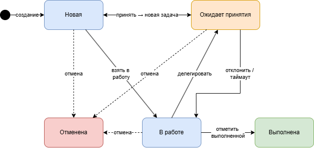
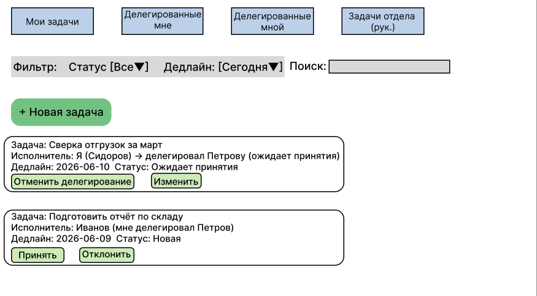
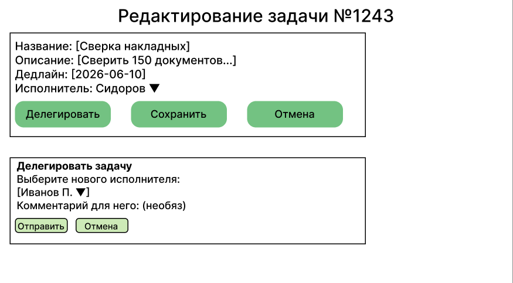
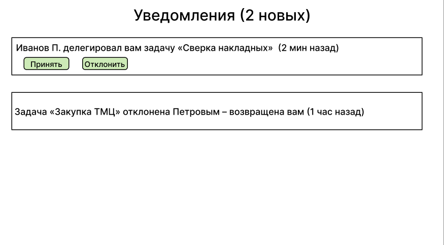

# Модуль «Управление и планирование задач»: постановка для разработки

## 1. Допущения и открытые вопросы

**Допущения (что мы берём за базу, пока бизнес не скажет иначе):**

- Текущая аутентификация (логин/роли: сотрудник, руководитель, админ) остаётся без изменений.
- Задачи уже имеют «срок выполнения» (из фильтра в текущей версии) - это поле существует, хотя в описании не было явно. Добавляем атрибут «Дедлайн» (дата+время).
- Делегирование возможно только между пользователями одной роли «сотрудник» или от сотрудника к руководителю? По умолчанию: любой пользователь может делегировать задачу любому другому, кроме администратора (админ не участвует в задачах как исполнитель).
- После делегирования исходный исполнитель теряет права на редактирование задачи (кроме отмены делегирования, если это разрешено).
- Уведомления пока реализуем через внутренний центр уведомлений (email - опционально, вынесем во 2–3 итерацию).

**Открытые вопросы к заказчику:**

1. Делегирование с перекладыванием ответственности? Кто отвечает за конечный результат: исходный постановщик, первый исполнитель или тот, кто в итоге сделал? Нужна ли возможность «вернуть» задачу обратно с комментарием?
2. Делегирование на отдел – у нас уже есть «руководитель ставит задачу на отдел» (старая логика). Как это сочетается с делегированием? Отдел – это групповой исполнитель? Или каждый сотрудник отдела видит, но отвечает кто-то один?
3. Сроки при делегировании: должен ли пересчитываться дедлайн? Например, исходный срок 5 дней, передал коллеге – оставить тот же или разрешить новому исполнителю запросить перенос?
4. История делегирований: нужно ли хранить цепочку передач (кто кому и когда) и показывать её в карточке задачи?
5. Ограничения на глубину делегирования: можно ли делегировать уже делегированную задачу? (предлагаю – да, но не более 3 уровней, чтобы не было бесконечных перекладываний).

## 2. Ролевая модель (с учётом делегирования)

| Роль          | Кто может делегировать                                                                     | Кому может делегировать                    | Видит прогресс переданной задачи                                   | Ответственность после передачи                                                                                                                                                          | Что доступно админу                                                                                        |
|---------------|--------------------------------------------------------------------------------------------|--------------------------------------------|--------------------------------------------------------------------|-----------------------------------------------------------------------------------------------------------------------------------------------------------------------------------------|------------------------------------------------------------------------------------------------------------|
| Сотрудник     | Только задачи, где он текущий исполнитель (в т.ч. полученные по делегированию)             | Другим сотрудникам или своему руководителю | Да, но только статус и комментарии (не может редактировать)        | Остаётся у исходного исполнителя, если явно не передана с согласия постановщика? Уточнено: по умолчанию ответственность переходит к новому исполнителю, но исходный обязан отслеживать. | Может просматривать любые задачи, редактировать статус только как админ (принудительно закрыть/отменить).  |
| Руководитель  | Личные задачи + задачи своего отдела (если они назначены на него персонально или на отдел) | Любому сотруднику своего отдела            | Да, по всем задачам подчинённых (включая переданные внутри отдела) | Несёт управленческую ответственность, но исполнителем считается тот, кто «взял» последним.                                                                                              | То же + может передавать задачи между отделами? Пока нет – на первой итерации только внутри одного отдела. |
| Администратор | Не делегирует (не участвует как исполнитель)                                               | –                                          | Может видеть всю цепочку делегирований через админку               | –                                                                                                                                                                                       | Управление пользователями, ролями, просмотр всех задач, ручное изменение статуса (аудит).                  |

>**Важное уточнение:** Ответственность за выполнение (перед бизнесом) несёт тот, кто указан в поле «Ответственный исполнитель» (текущий). Но если задача провалена, исходный постановщик (кто создал) может пожаловаться руководителю – это уже процесс, не автоматика.

## 3. Функциональные / Нефункциональные требования

### Функции личных задач (база)
- Создание: название, описание, статус («Новая»), дедлайн (обязательное поле), исполнитель – выбирается из списка пользователей с ролью «сотрудник» или «руководитель».
- Редактирование: пока задача не в статусе «Выполнена» или «Отменена», автор и текущий исполнитель могут менять название, описание, дедлайн (только если срок не истёк).
- Удаление: только автор или админ, с подтверждением. Если задача делегирована – удалить нельзя, только отменить.
- Фильтр по статусу, дедлайну, исполнителю (для руководителя – по сотрудникам отдела).

### Функции делегирования (новое)
- **Кто кому может делегировать:**

   - Сотрудник → другому сотруднику (любому, не только отдел).
   - Сотрудник → своему руководителю (редко, но допустимо).
   - Руководитель → любому сотруднику своего отдела.
   - Запрещено: делегировать админу, делегировать задачу, которая уже делегирована и не принята (чтобы избежать конфликтов).

- **Что происходит после передачи:**

1. Текущий исполнитель нажимает «Делегировать», выбирает нового исполнителя из списка (с учётом правил выше).
2. Система создаёт приглашение-уведомление новому исполнителю с кнопками «Принять» / «Отклонить».
3. Задача переходит в промежуточный статус «Ожидает принятия». Старый исполнитель не может редактировать задачу, новый пока не может – только принять или отклонить.
4. Если новый исполнитель принимает – статус возвращается к «Новая» или «В работе» (в зависимости от договорённости, проще – «Новая»). Старый исполнитель перестаёт быть исполнителем.
5. Если отклоняет – задача возвращается к старому исполнителю с тем же статусом, что был до делегирования.
6. Если нет ответа 2 дня (по умолчанию) – автоматический отказ, задача возвращается.

- **Кто отвечает за результат:** после принятия – новый исполнитель. Исходный постановщик (автор) и старый исполнитель получают уведомления о смене исполнителя.

### Нефункциональные требования
- Производительность: список задач (до 1000 записей) открывается < 1 сек.
- Логирование всех действий с делегированием (кто, кому, когда, результат).
- Поддержка до 50 одновременных пользователей (на старте).
- Web-интерфейс (адаптив не нужен, только десктоп).

## 4. Критерии приёмки (3 ключевых сценария)

### Сценарий 1: Успешное делегирование личной задачи сотрудником другому сотруднику

- Дано: пользователь А имеет задачу в статусе «В работе» (он исполнитель). Пользователь Б – другой сотрудник.
- Когда: А нажимает «Делегировать», выбирает Б, подтверждает.
- Тогда:

1. Б получает уведомление с задачей.
2. Задача А переходит в статус «Ожидает принятия», А не может её редактировать.
3. Б нажимает «Принять» → статус становится «Новая» (для Б), в поле «Исполнитель» – Б.
4. А видит задачу в своём списке «Делегированные мной» (отдельный фильтр) только для чтения.
5. История делегирования показывает: А → Б, дата, время.

### Сценарий 2: Отклонение делегирования из-за истечения срока ожидания

- Дано: А делегировал задачу Б. Б не реагирует 2 рабочих дня.
- Когда: проходит 48 часов (настроено).
- Тогда:

1. Задача автоматически возвращается к А, статус восстанавливается (например, «В работе»).
2. А получает уведомление «Делегирование отклонено автоматически».
3. Б больше не видит эту задачу (уведомление пропадает).

### Сценарий 3: Руководитель делегирует задачу, назначенную на отдел, конкретному сотруднику

- Дано: Руководитель создал задачу на отдел «Маркетинг» (все сотрудники видят её в своих списках как «Задачи отдела», никто не взял).
- Когда: Руководитель выбирает эту задачу, нажимает «Назначить исполнителя» (по сути, принудительное делегирование), выбирает Иванова.
- Тогда:

1. Задача пропадает из общего списка отдела, появляется у Иванова со статусом «Новая».
2. Другие сотрудники отдела больше не видят задачу (только в архиве, если фильтр включён).
3. Иванов не может отклонить (принудительное назначение), но может переделегировать другому (с разрешения руководителя).

## 5. Диаграмма состояний задачи (с учётом делегирования)

**Состояния:**

- Новая – задача создана, исполнитель назначен.
- В работе – исполнитель начал (нажал «Взять в работу»).
- Ожидает принятия – задача делегирована новому исполнителю, ждёт ответа.
- Выполнена – закрыта исполнителем.
- Отменена – автор или админ отменили до выполнения.

**Переходы:**

- Новая → В работе (исполнитель стартует)
- В работе → Выполнена (исполнитель отмечает)
- Любое состояние (кроме Выполнена/Отменена) → Отменена (автор/админ)
- Новая/В работе → Ожидает принятия (делегирование)
- Ожидает принятия → Новая (новый исполнитель принял) – после принятия задача становится «Новой» для него.
- Ожидает принятия → исходное состояние (отклонение или таймаут)

### Крайние случаи:

1. **Исполнитель отклонил задачу**

- Из состояния «Ожидает принятия» → возврат в то состояние, которое было до делегирования (например, «В работе» у старого исполнителя).
- В UI показываем сообщение «Иванов отклонил делегирование».

2. **Делегирование отменено исходным исполнителем до того, как новый принял**

- Если текущий исполнитель до истечения срока ожидания нажал «Отменить делегирование» – задача сразу возвращается к нему в прежнем статусе.
- Новый исполнитель получает уведомление «Делегирование отменено».

3. **Срок задачи наступил, пока задача не принята**

- Дедлайн наступил, задача в статусе «Ожидает принятия».
- Правило: сначала обрабатываем просрочку дедлайна. Задача не может висеть с просроченным дедлайном в ожидании.
- Система автоматически отклоняет делегирование (как при таймауте), задача возвращается исходному исполнителю, но помечается как «Просрочена».
- Исходный исполнитель обязан либо выполнить, либо перенести дедлайн (с согласия автора).

## 6. Дорабатываемые функции существующей системы

| Что было                                         | Что нужно изменить/дополнить                                                                                            | Почему                                                                                   |
|--------------------------------------------------|-------------------------------------------------------------------------------------------------------------------------|------------------------------------------------------------------------------------------|
| Поля задачи: название, описание, статус          | Добавить поле «Дедлайн» (обязательное), «Ответственный исполнитель» (может меняться), «Цепочка делегирований» (массив). | Без дедлайна нет планирования. Без истории делегирования – не понятно, кто перекладывал. |
| Статусы: Новая → В работе → Выполнена            | Добавить статус «Ожидает принятия». Разрешить возврат из «Ожидания» в предыдущие статусы.                               | Нужен промежуточный шаг, чтобы не терять задачу при передаче.                            |
| Список задач с фильтром по статусу и сроку       | Добавить фильтр «Делегированные мной», «Делегированные мне», «Задачи отдела» (для руководителя).                        | Пользователи должны видеть, кому передали, и контролировать.                             |
| Руководитель ставит задачу на отдел – видна всем | Доработать: принудительное назначение исполнителя из отдела (с удалением из общего списка). Иначе задача повиснет.      | Делегирование не работает с «задачей на всех». Кто-то должен отвечать.                   |
| Действия: создать, редактировать, удалить        | Добавить «Делегировать», «Принять/Отклонить», «Отменить делегирование». Ограничить удаление для переданных задач.       | Без этих действий нет сценария передачи.                                                 |

## 7. Приоритеты (разбивка на итерации)
### Итерация 1 (MVP, 2-3 недели) – только личные задачи + базовое делегирование без автоматического таймаута и истории.

- Дедлайн, статус «Ожидает принятия», ручное принятие/отклонение.
- Делегирование от сотрудника к сотруднику (без отделов).
- Уведомления только внутри системы (не email).
- Фильтр «Делегированные мне» и «Мной».

### Итерация 2 (2 недели) – работа с отделами и ответственность.

- Принудительное назначение руководителем на сотрудника.
- Делегирование внутри отдела с контролем.
- Автоматический таймаут (2 дня) и обработка просрочки дедлайна.

### Итерация 3 (1 неделя) – история, аудит и улучшения.

- Цепочка делегирований в карточке задачи.
- Email-уведомления (опционально).
- Отмена делегирования исходным исполнителем.

>**Почему так:** Без базового делегирования бизнес не получит ценности быстро. Отделы – важная часть, но их можно зафиксить во 2 итерации, а на первой просто разрешить делегирование между любыми сотрудниками.

## 8. Макеты экранов

### Экран 1: Список задач пользователя (после внедрения)

### Экран 2: Карточка задачи (режим делегирования)

### Экран 3: Уведомления (центр)

## 9. Оценка трудозатрат и рисков

### Декомпозиция работ (человеко-часы, backend+frontend):

| Работа                                                     | Часы                            |
|------------------------------------------------------------|---------------------------------|
| Доработка БД (поля дедлайн, цепочка, статусы)              | 8                               |
| API: создание/редактирование с учётом дедлайна             | 6                               |
| API: делегирование (приглашение, принятие, отказ, таймаут) | 16                              |
| API: история и фильтры                                     | 8                               |
| UI: список задач с новыми фильтрами                        | 10                              |
| UI: модалка делегирования + уведомления                    | 8                               |
| UI: карточка задачи (отображение делегирования)            | 6                               |
| Юнит-тесты + интеграционные                                | 10                              |
| Документация для команды (кратко)                          | 4                               |
| Итого (ориентир)                                           | 76 ч (~2 недели 2 разработчика) |

### Топ-5 рисков и реакция:

1. Бизнес меняет правило «ответственность переходит» на «остаётся у первого»
→ Реакция: сделать поле «Ответственный» отдельно от «Исполнитель», но это усложнит MVP. Обсудить до старта итерации 1.
2. Пользователи начнут бесконтрольно делегировать всё подряд
→ Реакция: добавить ограничение: нельзя делегировать задачу, если уже было 3 делегирования по цепочке. И сделать уведомление руководителю при каждой передаче.
3. Таймаут 2 дня не подходит для срочных задач
→ Реакция: вынести настройку таймаута в админку (значение по умолчанию, но для каждой задачи можно задать индивидуально? В 3 итерации).
4. Старая логика «задача на отдел» конфликтует с делегированием
→ Реакция: на время итерации 1 отключить возможность создавать задачи на отдел (только на конкретного человека). В итерации 2 переделать механизм отделов.
5. Не успеваем к сроку из-за сложного UI уведомлений
→ Реакция: сначала сделать простой попап «У вас новое делегирование» без центра уведомлений, а историю хранить в логах. Центр уведомлений – в итерацию 2.