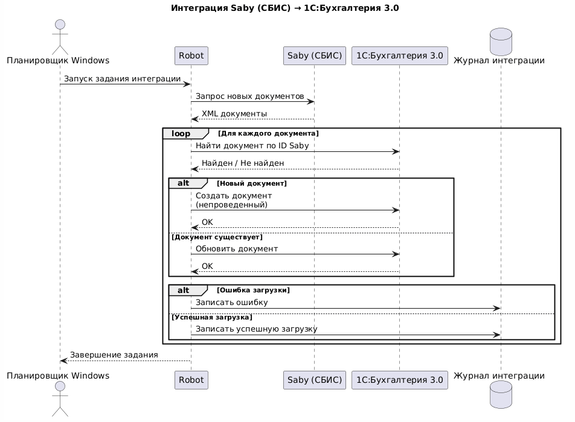

# Интеграция Saby (СБИС) с 1С:Бухгалтерия 3.0 для автоматического обмена первичными документами

## 1. Краткая информация о проекте
Компания: ООО "ЦИБ"

Моя роль: Системный аналитик / Руководитель проекта по автоматизации

Срок: 6 мес.

Заказчик: Бухгалтерия

Основание для разработки: Необходимость автоматизации загрузки первичных документов из Saby (СБИС) в 1С для ведения бухгалтерского учёта.

Цель разработки: Обеспечить автоматическую ежедневную загрузку документов из Saby в 1С без участия пользователя.

## 2. Исходная ситуация (As-Is)
### 2.1. Бизнес-процесс до автоматизации
1. Бухгалтер заходит в личный кабинет Saby (СБИС).

2. Просматривает список новых документов от контрагентов (счета, акты, накладные, УПД).

3. Выгружает каждый документ вручную (обычно в формате Excel или PDF).

4. Переносит данные из выгруженного файла в 1С:Бухгалтерия 3.0 (создает новые документы, заполняет реквизиты, суммы, номенклатуру).

5. Проверяет корректность введенных данных.

6. Проводит документы в 1С.

## 2.2. Проблемы и их влияние на бизнес

| Проблема                      | Влияние на бизнес                                                                        |
|-------------------------------|------------------------------------------------------------------------------------------|
| Высокие трудозатраты          | Бухгалтер тратит до 10–15 часов в неделю на ручной перенос данных.                       |
| Человеческий фактор           | Ошибки при вводе сумм, дат, контрагентов (риск некорректного учета, штрафы).             |
| Задержки в учете              | Документы попадают в 1С с опозданием (несвоевременное отражение доходов/расходов).       |
| Низкая пропускная способность | При росте документооборота бухгалтерия не справляется (требуется найм доп. сотрудников). |

## 3. Целевое решение (To-Be)
### 3.1. Концепция решения
Разработать и внедрить автоматическую интеграцию между Saby (СБИС) и 1С:Бухгалтерия 3.0, при которой документы из Saby автоматически загружаются в 1С в заданное время (ежедневно, ночью) без участия бухгалтера.

### 3.2. Ключевые требования
- Автоматический режим: Загрузка происходит по расписанию, без ручных действий.

- Полнота данных: Все типы первичных документов (счета, акты, накладные, УПД, счета-фактуры) загружаются полностью со всеми реквизитами и табличными частями.

- Учетная логика: Документы в 1С создаются с правильными видами операций и счетами учета.

- Детектор дублей: Исключено создание дубликатов документов в 1С.

- Обработка ошибок: При сбое интеграции документы не теряются, а попадают в очередь на повторную загрузку или требуют ручного вмешательства с понятной диагностикой.

- Прозрачность: У бухгалтера есть журнал обмена, где видно, какие документы загружены, какие — в ошибках.

## 4. Мои задачи и этапы работы
### 4.1. Анализ и сбор требований
**Интервью с бухгалтерией:**

- Выявил перечень документов, которые необходимо загружать (акты, счета, УПД, накладные).

- Определил критичные реквизиты и правила заполнения в 1С (например, договор контрагента, ставка НДС, статья доходов/расходов).

- Задокументировал бизнес-правила: что делать с документами, поступившими задним числом, как обрабатывать отказы и корректировки.

**Анализ текущего документооборота:**

- Оценил среднемесячный объем документов (300-400 документов).

- Выявил пиковые нагрузки (конец месяца, квартала, года).

### 4.2. Проектирование интеграции
**Выбор подхода к интеграции:**

- Рассмотрел варианты: штатные механизмы Saby, доработка 1С, использование внешнего модуля (остановились на внешнем модуле).

- Обосновал выбор: не требуется доработка 1С.

**Разработка логики обмена:**

Выгрузка из Saby: Какие статусы документов считать готовыми к выгрузке.

**Загрузка в 1С:**

- Поиск контрагента в 1С по ИНН/КПП.

- Поиск договора.

- Заполнение номенклатуры (по артикулу/наименованию из документа, если не найдено — создание с признаком "требует ручной обработки").

- Обработка ошибок: Алгоритмы повторных попыток, уведомления ответственному бухгалтеру.

### 4.3. Подготовка документации
**Для разработчиков:**

- Техническое задание (ТЗ) на создания модуля интеграции.

- Диаграмма последовательности (Sequence Diagram) процесса загрузки документа.

**Для бухгалтерии (пользовательская документация):**

- Инструкция: "Как настроить интеграцию СБИС-1С" (для администратора).

- Инструкция: "Что делать, если документ не загрузился" (журнал обмена, типовые ошибки и их устранение).

- Памятка: "Как проверить корректность загрузки документов за период".

### 4.4. Тестирование
**Подготовка тестовых данных:**

- Создал тестовыю копию базы данных 1С.

- Выбрал тестовых контрагентов в Saby и 1С.

- Выбрал набор тестовых документов (все типы, с разными комбинациями реквизитов).

**Тестирование сценариев:**

- Позитивные: Новый документ появился в Saby → успешно загрузился в 1С.

- Негативные: Нет контрагента в 1С (должен создаться), нет номенклатуры (должен создаться флаг "требует обработки"), документ уже загружен (не создавать дубль).

- Интеграционные: Проверка работы регламентного задания (запуск по расписанию).

**Приемочное тестирование:**

- Организовал тестирование с ключевыми бухгалтерами на реальных документах за прошлый период (сравнение ручной загрузки и автоматической).

### 4.5. Внедрение и сопровождение
**Разработка плана перехода:**

- Запуск в ограниченном режиме (короткий период) для контроля качества.

- Отключение ручной загрузки после подтверждения корректности автоматической.

**Обучение:**

- Провел обучение для бухгалтеров (как контролировать автоматическую загрузку, что делать в нештатных ситуациях).

- Передал инструкции и памятки.

**Мониторинг после запуска:**

- В первую неделю ежедневно проверял журнал обмена, собирал обратную связь.

- Оперативно исправлял выявленные недочеты (например, некорректное заполнение доп. реквизитов).

## 5. Результаты
### 5.1. Количественные результаты

| Метрика                                 | До проекта         | После проекта       | Изменение                   |
|-----------------------------------------|--------------------|---------------------|-----------------------------|
| Время на загрузку документов (в неделю) | 10 часов           | 30 минут (контроль) | Экономия 9,5 часов          |
| Ошибки ручного ввода                    | 5–7% документов    | 0%                  | Полное исключение           |
| Задержка от поступления до учета        | 2–3 дня            | < 1 часа            | Ускорение в 20+ раз         |
| Пропускная способность                  | 50 документов/день | Без ограничений     | Снято ограничение           |

### 5.2. Качественные результаты
- Бухгалтеры перестали выполнять рутинную механическую работу и сосредоточились на аналитике и сложных участках.

- Ускорилось закрытие периодов (конец месяца, квартала, года).

- Повысилась прозрачность документооборота (журнал обмена позволяет отследить судьбу любого документа).

- Создана масштабируемая инфраструктура: при росте объема документов не требуется найм дополнительных сотрудников.

## 6. Технические детали
Платформа ЭДО: Saby (СБИС).

Платформа 1С: 1С:Бухгалтерия 3.0 (на базе управляемых форм).

Способ интеграции: Внешний модуль.

Штатная синхронизация: Через обработку "Обмен с СБИС".

Использование посредника: Планировщик Windows.

Форматы данных: XML.

Расписание: Ежедневно в 00:00.

## Диаграмма последовательности

