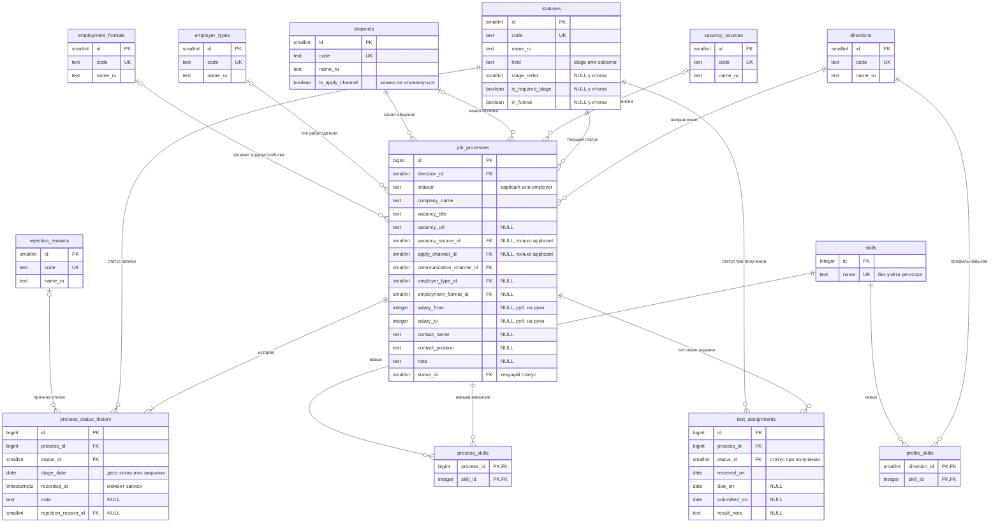

# Логическая модель данных: Job Search CRM

| | |
|---|---|
| Версия | 2.0 |
| Дата | 10.10.2026 |
| Автор | Юрий Савиных |
| Статус | На проверке автором |
| Связанные документы | [Vision & Scope](../requirements/01-vision-and-scope.md), [ADR-001](../adr/ADR-001-record-only-qualified-processes.md), [Пользовательские истории](../requirements/02-user-stories.md), [Статусная модель](../process/03-status-model.md) |

## 1. Назначение документа

Описать сущности, атрибуты, связи и правила целостности данных, которые нужны для историй
US-01–US-20 и ответов на бизнес-вопросы Q1–Q9, Q12, Q13. Документ не зависит от конкретной
СУБД: типы данных, индексы и DDL описываются в физической модели. Модель служит основанием для
DDL, аналитических SQL-запросов и тест-кейсов.

Версия 2.0 отражает переход к учёту только квалифицированных процессов (решение D23, ADR-001):
отклики без интервью и тестового не фиксируются, даты откликов и ответов работодателя не
хранятся, автозакрытия нет.

## 2. Соглашения

- Имена таблиц и полей: английские, `snake_case`; имена таблиц во множественном числе (DM-01).
- Справочники хранятся таблицами, а не типами ENUM, чтобы менять значения миграцией без
  пересоздания типов (DM-02). Исключение: инициатор процесса (`applicant`, `employer`) и тип
  статуса (`stage`, `outcome`) имеют фиксированный набор значений, от которого зависят
  бизнес-правила, и контролируются ограничением (раздел 6).
- Первичные ключи: у справочников `smallint`, у рабочих таблиц `bigint`, у навыков `integer`,
  значения формирует СУБД (DM-02).
- Даты этапов и событий хранятся без времени (решение D21); момент записи в историю хранится с
  временем и часовым поясом (DM-07).
- Сокращения уровня контроля правил (раздел 6): **Д** — ограничение базы данных (`NOT NULL`,
  `CHECK`, `FOREIGN KEY`, `UNIQUE`); **Т** — триггер; **П** — логика приложения в одной
  транзакции; **К** — проверочный запрос на согласованность данных.

## 3. ER-диаграмма

У справочников показаны ключевые атрибуты; поле `sort_order` (порядок вывода в списках) есть у
каждого справочника и описано в разделе 5.

## 4. Описание сущностей

### 4.1. `job_processes` — процесс

Дата начала процесса не хранится: она вычисляется по истории (раздел 7, DQ7).

| Атрибут | Описание | Обязательность | Источник |
|---------|----------|----------------|----------|
| `id` | Идентификатор процесса | Да | — |
| `direction_id` | Направление поиска | Да | D1, D7, US-01 |
| `initiator` | Кто начал процесс: `applicant` — процесс начат откликом соискателя, `employer` — работодатель вышел первым; после создания не меняется | Да | D11, INV-19 |
| `company_name` | Название компании | Да | US-01 |
| `vacancy_title` | Название вакансии | Да | US-01 |
| `vacancy_url` | Ссылка на вакансию | Нет | D31 |
| `vacancy_source_id` | Источник вакансии | Да для `applicant`; для `employer` не заполняется | D12 |
| `apply_channel_id` | Канал отклика | Да для `applicant`; для `employer` не заполняется | D12 |
| `communication_channel_id` | Канал общения (последний указанный; правится на месте) | Да | D12, TQ10 |
| `employer_type_id` | Тип работодателя | Нет | D20 |
| `employment_format_id` | Формат трудоустройства | Нет | D20 |
| `salary_from`, `salary_to` | Зарплатная вилка «на руки», рубли, целые числа; можно заполнить одно из двух | Нет | D15 |
| `contact_name`, `contact_position` | Контакт у работодателя: имя и должность | Нет | DM-03 |
| `note` | Комментарий соискателя | Нет | US-05 |
| `status_id` | Текущий статус процесса (контролируемая избыточность, DQ1) | Да | D14, NFR-03 |

### 4.2. `process_status_history` — история статусов

Одна запись — один установленный статус. Записи не перезаписываются при смене статуса; дату можно
исправить, а запись этапа, который не состоялся, удалить (решение D22). Автор записи не хранится:
все записи делает соискатель (D24, DQ11).

| Атрибут | Описание | Обязательность | Источник |
|---------|----------|----------------|----------|
| `id` | Идентификатор записи | Да | — |
| `process_id` | Процесс | Да | SR10 |
| `status_id` | Установленный статус | Да | SR10 |
| `stage_date` | Дата этапа (прошедшего или запланированного) либо дата закрытия; смысл по статусам: см. таблицу статусов в документе «Статусная модель» | Да | D21 |
| `recorded_at` | Момент, когда запись создана | Да | SR10 |
| `note` | Комментарий | Нет | US-04 |
| `rejection_reason_id` | Причина отказа; заполняется только у записей «Отказ работодателя» и «Мой отказ» | Нет (обязательность по правилу SR9, см. INV-08) | D16 |

### 4.3. `test_assignments` — тестовые задания

| Атрибут | Описание | Обязательность | Источник |
|---------|----------|----------------|----------|
| `id` | Идентификатор | Да | — |
| `process_id` | Процесс | Да | SR7 |
| `status_id` | Статус, действовавший в момент получения задания; после создания не пересчитывается | Да | SR7 |
| `received_on` | Дата получения (для процесса, начатого с выдачи тестового, это первая дата этапа «Отклик») | Да | US-07 |
| `due_on` | Срок сдачи | Нет (DQ5) | US-07 |
| `submitted_on` | Дата сдачи | Нет | US-07 |
| `result_note` | Комментарий о результате | Нет | US-07 |

### 4.4. Навыки

| Сущность | Атрибут | Описание |
|----------|---------|----------|
| `skills` | `id`, `name` | Общий справочник навыков; название уникально без учёта регистра и пробелов по краям (US-11) |
| `process_skills` | `process_id`, `skill_id` | Навыки вакансии; составной первичный ключ; навык не повторяется у одного процесса |
| `profile_skills` | `direction_id`, `skill_id` | Профиль навыков соискателя по направлению (решение D3); составной первичный ключ |

## 5. Справочники

У каждого справочника есть поля `id`, `code` (латиница, уникальный), `name_ru` и `sort_order`
(порядок вывода). Изменение состава выполняется миграцией (US-10, UQ3 предыдущей версии).

| Таблица | Коды и названия |
|---------|-----------------|
| `directions` | `SA_BA` — Системный / бизнес-аналитик; `TW` — Технический писатель |
| `vacancy_sources` | `HH_RU` — hh.ru; `TELEGRAM_CHANNEL` — Telegram-канал; `COMPANY_SITE` — сайт компании; `OTHER` — другое |
| `channels` | `HH_RU` — hh.ru; `TELEGRAM` — Telegram; `EMAIL` — почта (все три с `is_apply_channel = true`); `PHONE` — телефон (`is_apply_channel = false`) |
| `employer_types` | `DIRECT` — прямой работодатель; `OUTSTAFF` — аутстафф; `STAFFING_AGENCY` — кадровое агентство |
| `employment_formats` | `LABOR_CONTRACT` — ТК; `CIVIL_CONTRACT` — ГПХ (ИП/СЗ) |
| `rejection_reasons` | `NO_REASON` — без причины; `EXPERIENCE_MISMATCH` — не подошёл опыт; `OTHER_CANDIDATE_CHOSEN` — выбрали другого; `CONDITIONS_MISMATCH` — условия не подошли мне; `OTHER` — другое |

Таблица `statuses`:

| Код | Название | `kind` | `stage_order` | `is_required_stage` | `in_funnel` |
|-----|----------|--------|---------------|---------------------|-------------|
| `APPLIED` | Отклик | stage | 1 | Нет | Нет |
| `HR_INTERVIEW` | HR-интервью | stage | 2 | Да | Да |
| `TECH_INTERVIEW` | Техническое собеседование | stage | 3 | Да | Да |
| `TEAM_MEETING` | Знакомство с командой | stage | 4 | Нет | Да |
| `SECURITY_CHECK` | СБ | stage | 5 | Нет | Да |
| `OFFER` | Оффер | stage | 6 | Да | Да |
| `OFFER_ACCEPTED` | Оффер принят | outcome | нет | нет | нет |
| `OFFER_DECLINED` | Оффер отклонён мной | outcome | нет | нет | нет |
| `REJECTED_BY_EMPLOYER` | Отказ работодателя | outcome | нет | нет | нет |
| `WITHDRAWN_BY_ME` | Мой отказ | outcome | нет | нет | нет |
| `NO_RESPONSE` | Нет ответа | outcome | нет | нет | нет |

Поля `kind`, `stage_order`, `is_required_stage`, `in_funnel` нужны для правил SR11 (воронка) и
SR13 (напоминания). Процесс достиг обязательного этапа воронки, если в его истории есть статус
этапа с порядком не меньше порядка этого этапа; необязательный этап считается, только если такой
статус был; статус с `in_funnel = false` в воронку не входит (DQ8).

## 6. Правила целостности

| ID | Правило | Уровень | Источник |
|----|---------|---------|----------|
| INV-01 | `initiator` принимает значения `applicant` или `employer` | Д | D11 |
| INV-02 | Для `applicant` обязательны `vacancy_source_id` и `apply_channel_id`; для `employer` оба поля пусты | Д | D11, D12, US-01 |
| INV-03 | `communication_channel_id` обязателен для процессов обоих инициаторов | Д | D12, TQ10 |
| INV-04 | `apply_channel_id` ссылается только на канал с `is_apply_channel = true` | Т | D12 |
| INV-05 | `salary_from` и `salary_to` положительны; если заданы оба, `salary_from` не больше `salary_to` | Д | D15, US-01 |
| INV-06 | Отменено (решение D13): дата первого ответа не хранится | — | — |
| INV-07 | `vacancy_url`, если задана, начинается с `http://` или `https://` | Д | US-01 |
| INV-08 | `rejection_reason_id` допустим только у записей истории со статусом «Отказ работодателя» или «Мой отказ» (Т). Обязателен, если процесс закрыт отказом и в его истории есть этап HR-интервью или более поздний либо есть тестовое задание (П, К) | Т, П, К | D16, SR9 |
| INV-09 | Первая запись истории процесса (по `recorded_at`, затем по `id`) имеет статус типа «Этап»: создать процесс сразу с итогом нельзя (прежняя формулировка про «Отклик» и «HR-интервью» заменена) | П, К | SR1, US-01 |
| INV-10 | `job_processes.status_id` равен статусу последней записи истории (по `recorded_at`, затем по `id`). Смена статуса и запись истории выполняются в одной транзакции | П, Т, К | NFR-03, SR10 |
| INV-11 | Отменено (решение D13): правило о дате первого ответа | — | — |
| INV-12 | Отменено (решение D24): правило автозакрытия | — | — |
| INV-13 | В тестовом задании `due_on` и `submitted_on` не раньше `received_on` | Д | US-07 |
| INV-14 | Название навыка уникально без учёта регистра и пробелов по краям | Д | US-11 |
| INV-15 | Удаление процесса каскадно удаляет его историю, тестовые задания и связи с навыками. Значения справочников, на которые есть ссылки, удалить нельзя | Д | US-05, DM-06 |
| INV-16 | Даты этапов и событий хранятся как даты без времени; `recorded_at` — с временем и часовым поясом | Д | D21, NFR-06 |
| INV-17 | Рейтинг и пробелы по навыкам (Q5, Q6) учитывают процесс только если в его истории есть HR-интервью или более поздний этап; введённые навыки в остальных случаях не удаляются | Запрос | D8, US-11 |
| INV-18 | Единственную запись истории процесса удалить нельзя | П, Т | US-05 |
| INV-19 | `initiator` не меняется после создания процесса | П, Т | UQ1 (истории), DQ10 |
| INV-20 | Если первая запись истории процесса имеет статус «Отклик», у процесса есть хотя бы одно тестовое задание | П, К | D25, SR7 |

## 7. Производные данные

Эти значения не хранятся, а вычисляются запросами или представлениями.

| Показатель | Как вычисляется | Где используется |
|------------|-----------------|------------------|
| Дата начала процесса | Минимальная `stage_date` среди записей истории со статусом типа «Этап» (DQ7) | US-02 (фильтр по периоду), US-12–US-14 |
| Дата последнего этапа | Максимальная `stage_date` среди записей истории со статусом типа «Этап» | US-02, US-09 |
| Дата последней записи | Максимальная `stage_date` среди всех записей истории; при равенстве — максимальный `recorded_at` (DQ9) | US-02 (сортировка) |
| Процесс открыт | Тип текущего статуса — «Этап» | US-02, US-08, US-09 |
| Дата закрытия | `stage_date` последней записи с итоговым статусом | US-02, US-06 |
| Запланированный этап | Запись истории со статусом типа «Этап» и `stage_date` не раньше текущей даты | US-02, US-08, US-09 |
| Запланированный срок сдачи | Несданное тестовое задание (`submitted_on` пусто) со срокам `due_on` не раньше текущей даты | US-08, US-09 |
| Процесс достиг этапа | Правило SR11 по истории и таблице `statuses` | US-12, US-14 |
| Дни между этапами | Разница календарных дат между минимальными `stage_date` двух статусов процесса (SR12, D29) | US-13 |
| Середина вилки | Среднее `salary_from` и `salary_to`; если задано одно значение — оно | US-18 |

## 8. Трассировка

### 8.1. Бизнес-вопросы → данные

| Вопрос | Откуда считается |
|--------|------------------|
| Q1 | `job_processes` (`direction_id`, `initiator`); `process_status_history` + `statuses` (`kind`, `stage_order`, `is_required_stage`, `in_funnel`) |
| Q2 | `process_status_history` (первая `stage_date` каждого статуса), `job_processes.direction_id` |
| Q3 | `job_processes.vacancy_source_id` (только `applicant`); история (достиг технического собеседования и оффера) |
| Q4 | История (`stage_date`, `kind`), `test_assignments` (`due_on`, `submitted_on`), `job_processes.status_id` |
| Q5, Q6 | `process_skills`, `skills`, `profile_skills`; история (достиг HR-интервью); `job_processes.direction_id` |
| Q7 | `job_processes` (`salary_from`, `salary_to`, `direction_id`) |
| Q8 | `job_processes.status_id` (текущий итог-отказ); история (`rejection_reason_id`); `test_assignments` (наличие) |
| Q9 | `job_processes.apply_channel_id` (только `applicant`); история (достиг технического собеседования и оффера) |
| Q12 | `job_processes.apply_channel_id` × `communication_channel_id`; таблица `channels` |
| Q13 | `job_processes` (`employer_type_id`, `employment_format_id`); история (достиг технического собеседования и оффера) |

### 8.2. Истории → сущности

| Истории | Сущности |
|---------|----------|
| US-01, US-02, US-03 | `job_processes`, `process_status_history`, `test_assignments`, справочники |
| US-04, US-05, US-06 | `job_processes`, `process_status_history`, `statuses`, `rejection_reasons`, `channels` |
| US-07 | `test_assignments`, `process_status_history` |
| US-08, US-09 | `process_status_history`, `test_assignments`, `statuses`, `job_processes` |
| US-10 | Все справочники |
| US-11, US-17 | `skills`, `process_skills`, `profile_skills` |
| US-12–US-16, US-18 | Все рабочие таблицы и справочники (чтение) |
| US-19, US-20 | Вся схема (демо-данные, миграции) |

## 9. Принятые решения

| ID | Решение |
|----|---------|
| DM-01 | Имена таблиц и полей на английском, `snake_case`, таблицы во множественном числе: `job_processes`, `process_status_history`, `test_assignments` и т. д. |
| DM-02 | Справочники — таблицы (поля `id`, `code`, `name_ru`, `sort_order`), а не типы ENUM. Ключи: `smallint` у справочников, `bigint` у рабочих таблиц, значения формирует СУБД (`generated always as identity`). Таблица `statuses` дополнительно хранит тип, порядок этапа и признаки обязательности и участия в воронке для правил SR11 и SR13 |
| DM-03 | Контакт хранится двумя необязательными полями процесса (`contact_name`, `contact_position`), один контакт на процесс. Отдельная сущность не нужна: ни один из вопросов Q1–Q9, Q12, Q13 контакты не использует |
| DM-04 | Навыки: общий справочник `skills` (название уникально без учёта регистра), связи `process_skills` (процесс — навык) и `profile_skills` (направление — навык). Подсказки по направлению строятся из использования |
| DM-05 | Логическая модель оформляется ER-диаграммой Mermaid в Markdown; физическая модель и словарь данных — отдельным документом. Draw.io для ER не используется |
| DM-06 | Удаление процесса жёсткое, с каскадом на историю, тестовые задания и связи с навыками (US-05). Мягкого удаления нет |
| DM-07 | Даты этапов и событий — тип «дата»; момент записи в историю — «дата и время с часовым поясом» (решение D21, NFR-06) |

## 10. Вопросы

### 10.1. Закрытые вопросы версии 1.0

| ID | Решение | Статус |
|----|---------|--------|
| DQ1 | Текущий статус хранится в `job_processes.status_id` (контролируемая избыточность); согласованность с историей обеспечивают транзакция и триггер (INV-10) | Действует |
| DQ2 | Один справочник `channels` с признаком `is_apply_channel`; в интерфейсе по-прежнему два списка: каналы отклика и каналы общения (US-10) | Действует |
| DQ3 | Отдельных таблиц компаний и вакансий нет: компания и название вакансии — текстовые поля процесса | Действует |
| DQ4 | Причина отказа хранится в записи истории, закрывающей процесс | Действует |
| DQ5 | Срок сдачи тестового задания необязателен; задания без срока не считаются запланированными (SR13) | Действует |
| DQ6 | Обязательность даты первого ответа | Отменено: дата первого ответа не хранится (D13) |

### 10.2. Открытые вопросы

| ID | Вопрос | Предварительный ответ |
|----|--------|-----------------------|
| DQ7 | Хранить ли дату начала процесса? | Нет, вычислять как минимальную `stage_date` среди записей-этапов (D21): иначе её пришлось бы синхронизировать с историей при каждой правке даты |
| DQ8 | Нужен ли в справочнике статусов признак участия в воронке `in_funnel`? | Да: тогда правило SR11 («Отклик» вне воронки) управляется данными, а не кодом запросов |
| DQ9 | Что считать «датой последней записи» для сортировки списка (US-02)? | Максимальная `stage_date` среди всех записей истории, при равенстве — максимальный `recorded_at`: процессы с ближайшим будущим этапом оказываются выше |
| DQ10 | Как гарантировать неизменность инициатора (INV-19)? | Триггером в базе (дополнительно к приложению): значение определяет обязательные и пустые поля (INV-02), и случайная правка нарушила бы смысл записи |
| DQ11 | Нужен ли автор записи истории? | Нет: после отмены автозакрытия все записи делает соискатель (D24), поле `changed_by` не нужно |

## 11. Журнал изменений

| Версия | Дата | Изменения |
|--------|------|-----------|
| 0.1 | 09.10.2026 | Первая версия: 13 таблиц, ER-диаграмма, правила целостности INV-01–INV-18, производные данные, трассировка, решения DM-01–DM-07, вопросы DQ1–DQ6 |
| 1.0 | 09.10.2026 | Документ утверждён. Закрыты вопросы DQ1–DQ6; INV-04 реализован триггером; INV-11 уточнено решением DQ6 |
| 2.0 | 10.10.2026 | Переход к учёту только квалифицированных процессов (D23, ADR-001): из `job_processes` убраны `started_on`, `has_cover_letter`, `first_response_on`, ссылка стала необязательной, канал общения обязателен для обоих инициаторов; из истории убран `changed_by`; в `statuses` добавлен `in_funnel`; INV-06, INV-11, INV-12 отменены, INV-02, INV-03, INV-09 переписаны, добавлены INV-19, INV-20; производные данные и трассировка обновлены под US-01–US-20; DQ6 отменён, добавлены вопросы DQ7–DQ11 |