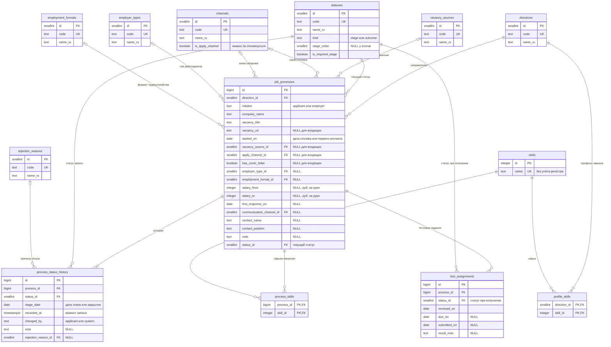

# Логическая модель данных: Job Search CRM

| | |
|---|---|
| Версия | 0.1 (черновик) |
| Дата | 09.10.2026 |
| Автор | Юрий Савиных |
| Статус | Черновик, ожидает ответов на вопросы DQ1–DQ6 |
| Связанные документы | [Vision & Scope](../requirements/01-vision-and-scope.md), [Пользовательские истории](../requirements/02-user-stories.md), [Статусная модель](../process/03-status-model.md) |

## 1. Назначение документа

Описать сущности, атрибуты, связи и правила целостности данных, которые нужны для историй
US-01–US-24 и ответов на бизнес-вопросы Q1–Q13. Документ не зависит от конкретной СУБД:
типы данных, индексы и DDL описываются в физической модели (следующий документ). Модель служит
основанием для DDL, аналитических SQL-запросов и тест-кейсов.

## 2. Соглашения

- Имена таблиц и полей: английские, `snake_case`; имена таблиц во множественном числе (DM-01).
- Справочники хранятся таблицами, а не типами ENUM, чтобы менять значения миграцией без
  пересоздания типов (DM-02). Исключение: инициатор процесса и автор записи истории имеют
  фиксированный набор значений, от которого зависят бизнес-правила, и контролируются ограничением
  (раздел 6).
- Первичные ключи: у справочников `smallint`, у рабочих таблиц `bigint`, у навыков `integer`,
  значения формирует СУБД (DM-02).
- Даты этапов и событий хранятся без времени (решение D21); момент записи в историю хранится
  с временем и часовым поясом (DM-07).
- Сокращения уровня контроля правил (раздел 6): **Д** — ограничение базы данных (`NOT NULL`,
  `CHECK`, `FOREIGN KEY`, `UNIQUE`); **Т** — триггер; **П** — логика приложения в одной
  транзакции; **К** — проверочный запрос на согласованность данных.

## 3. ER-диаграмма

У справочников в диаграмме показаны ключевые атрибуты; поле `sort_order` (порядок вывода в
списках) есть у каждого справочника и описано в разделе 5.

## 4. Описание сущностей

### 4.1. `job_processes` — процесс (отклик или входящий контакт)

| Атрибут | Описание | Обязательность | Источник |
|---------|----------|----------------|----------|
| `id` | Идентификатор процесса | Да | — |
| `direction_id` | Направление поиска | Да | D1, D7, US-01, US-03 |
| `initiator` | Кто начал процесс: `applicant` — отклик соискателя, `employer` — входящий контакт работодателя | Да | D11 |
| `company_name` | Название компании | Да | US-01 |
| `vacancy_title` | Название вакансии | Да | US-01 |
| `vacancy_url` | Ссылка на вакансию | Да для откликов соискателя; необязательно для входящих | US-01, US-03 |
| `started_on` | Дата начала: дата отклика (`applicant`) или дата первого контакта (`employer`) | Да | D11, D21 |
| `vacancy_source_id` | Источник вакансии | Да для `applicant`; для `employer` не заполняется | D12 |
| `apply_channel_id` | Канал отклика | Да для `applicant`; для `employer` не заполняется | D12 |
| `has_cover_letter` | Признак сопроводительного письма | Да для `applicant`; для `employer` не заполняется | D12, Q11 |
| `employer_type_id` | Тип работодателя | Нет | D20 |
| `employment_format_id` | Формат трудоустройства | Нет | D20 |
| `salary_from`, `salary_to` | Зарплатная вилка «на руки», рубли, целые числа; можно заполнить одно из двух | Нет | D15 |
| `first_response_on` | Дата первого содержательного ответа работодателя | Нет; для `employer` не заполняется | D13, US-06 |
| `communication_channel_id` | Канал общения (последний указанный) | Да для `employer`; для `applicant` вносится при фиксации ответа | D12, US-03, US-06 |
| `contact_name`, `contact_position` | Контакт у работодателя: имя и должность | Нет | DM-03 |
| `note` | Комментарий соискателя | Нет | US-08 |
| `status_id` | Текущий статус процесса (контролируемая избыточность, DQ1) | Да | D14, NFR-03 |

### 4.2. `process_status_history` — история статусов

Одна запись — один установленный статус. Записи не перезаписываются при смене статуса; дату
можно исправить, а запись этапа, который не состоялся, удалить (решение D22).

| Атрибут | Описание | Обязательность | Источник |
|---------|----------|----------------|----------|
| `id` | Идентификатор записи | Да | — |
| `process_id` | Процесс | Да | SR10 |
| `status_id` | Установленный статус | Да | SR10 |
| `stage_date` | Дата этапа (прошедшего или запланированного) либо дата закрытия; смысл по статусам: см. таблицу статусов в документе «Статусная модель» | Да | D21 |
| `recorded_at` | Момент, когда запись создана | Да | SR10 |
| `changed_by` | Автор записи: `applicant` или `system` (автозакрытие) | Да | SR10, US-11 |
| `note` | Комментарий | Нет | US-07 |
| `rejection_reason_id` | Причина отказа; заполняется только у записей «Отказ работодателя» и «Мой отказ» | Нет (обязательность по правилу SR9, см. INV-08) | D16 |

### 4.3. `test_assignments` — тестовые задания

| Атрибут | Описание | Обязательность | Источник |
|---------|----------|----------------|----------|
| `id` | Идентификатор | Да | — |
| `process_id` | Процесс | Да | SR7 |
| `status_id` | Статус, действовавший в момент получения задания; после создания не пересчитывается | Да | SR7 |
| `received_on` | Дата получения | Да | US-10 |
| `due_on` | Срок сдачи | Нет (DQ5) | US-10 |
| `submitted_on` | Дата сдачи | Нет | US-10 |
| `result_note` | Комментарий о результате | Нет | US-10 |

### 4.4. Навыки

| Сущность | Атрибут | Описание |
|----------|---------|----------|
| `skills` | `id`, `name` | Общий справочник навыков; название уникально без учёта регистра и пробелов по краям (US-15) |
| `process_skills` | `process_id`, `skill_id` | Навыки вакансии; составной первичный ключ; навык не повторяется у одного процесса |
| `profile_skills` | `direction_id`, `skill_id` | Профиль навыков соискателя по направлению (решение D3); составной первичный ключ |

## 5. Справочники

У каждого справочника есть поля `id`, `code` (латиница, уникальный), `name_ru` и `sort_order`
(порядок вывода). Изменение состава выполняется миграцией (US-14, UQ3).

| Таблица | Коды и названия |
|---------|-----------------|
| `directions` | `SA_BA` — Системный / бизнес-аналитик; `TW` — Технический писатель |
| `vacancy_sources` | `HH_RU` — hh.ru; `TELEGRAM_CHANNEL` — Telegram-канал; `COMPANY_SITE` — сайт компании; `OTHER` — другое |
| `channels` | `HH_RU` — hh.ru; `TELEGRAM` — Telegram; `EMAIL` — почта (все три с `is_apply_channel = true`); `PHONE` — телефон (`is_apply_channel = false`) |
| `employer_types` | `DIRECT` — прямой работодатель; `OUTSTAFF` — аутстафф; `STAFFING_AGENCY` — кадровое агентство |
| `employment_formats` | `LABOR_CONTRACT` — ТК; `CIVIL_CONTRACT` — ГПХ (ИП/СЗ) |
| `rejection_reasons` | `NO_REASON` — без причины; `EXPERIENCE_MISMATCH` — не подошёл опыт; `OTHER_CANDIDATE_CHOSEN` — выбрали другого; `CONDITIONS_MISMATCH` — условия не подошли мне; `OTHER` — другое |

Таблица `statuses`:

| Код | Название | `kind` | `stage_order` | `is_required_stage` |
|-----|----------|--------|---------------|---------------------|
| `APPLIED` | Отклик | stage | 1 | Да |
| `HR_INTERVIEW` | HR-интервью | stage | 2 | Да |
| `TECH_INTERVIEW` | Техническое собеседование | stage | 3 | Да |
| `TEAM_MEETING` | Знакомство с командой | stage | 4 | Нет |
| `SECURITY_CHECK` | СБ | stage | 5 | Нет |
| `OFFER` | Оффер | stage | 6 | Да |
| `OFFER_ACCEPTED` | Оффер принят | outcome | нет | нет |
| `OFFER_DECLINED` | Оффер отклонён мной | outcome | нет | нет |
| `REJECTED_BY_EMPLOYER` | Отказ работодателя | outcome | нет | нет |
| `WITHDRAWN_BY_ME` | Мой отказ | outcome | нет | нет |
| `NO_RESPONSE` | Нет ответа | outcome | нет | нет |

Поля `kind`, `stage_order`, `is_required_stage` нужны для правила расчёта воронки SR11:
процесс достиг обязательного этапа, если в его истории есть статус этапа с порядком не меньше
порядка этого этапа; необязательный этап считается, только если такой статус был.

## 6. Правила целостности

| ID | Правило | Уровень | Источник |
|----|---------|---------|----------|
| INV-01 | `initiator` принимает значения `applicant` или `employer`; `changed_by` — `applicant` или `system` | Д | D11, US-11 |
| INV-02 | Для `applicant` обязательны `vacancy_url`, `vacancy_source_id`, `apply_channel_id`, `has_cover_letter`. Для `employer` поля `vacancy_source_id`, `apply_channel_id`, `has_cover_letter` пусты | Д | US-01, US-03 |
| INV-03 | Для `employer` обязателен `communication_channel_id`, а `first_response_on` пусто | Д | US-03, US-06 |
| INV-04 | `apply_channel_id` ссылается только на канал с `is_apply_channel = true` (реализация на физическом уровне: составной внешний ключ или триггер) | Д или Т | D12 |
| INV-05 | `salary_from` и `salary_to` положительны; если заданы оба, `salary_from` не больше `salary_to` | Д | US-01 |
| INV-06 | `first_response_on` не раньше `started_on` (Д); не позже текущей даты (П, зависит от текущей даты) | Д, П | US-06 |
| INV-07 | `vacancy_url`, если задана, начинается с `http://` или `https://` | Д | US-01 |
| INV-08 | `rejection_reason_id` допустим только у записей истории со статусом «Отказ работодателя» или «Мой отказ» (Т). Обязателен, если в истории процесса есть этап HR-интервью или более поздний либо есть тестовое задание (П, К) | Т, П, К | D16, SR9 |
| INV-09 | Первая запись истории процесса (по `recorded_at`, затем по `id`): у `applicant` статус «Отклик» и `stage_date = started_on`; у `employer` статус «HR-интервью» и `stage_date` не раньше `started_on` | П, К | SR1, US-03 |
| INV-10 | `job_processes.status_id` равен статусу последней записи истории (по `recorded_at`, затем по `id`). Смена статуса и запись истории выполняются в одной транзакции | П, Т, К | NFR-03, SR10 |
| INV-11 | Для процесса `applicant` при установке статуса, отличного от «Отклик», «Нет ответа» и «Мой отказ», `first_response_on` должно быть заполнено (уточнение US-07, критерий 5, см. DQ6) | П | UQ1 |
| INV-12 | Автозакрытие: запись «Нет ответа» с автором `system` создаётся только для процесса `applicant` со статусом «Отклик» и пустым `first_response_on`, когда срок «`started_on` + 10 рабочих дней» уже прошёл; `stage_date` равна расчётному сроку | П, К | D10, SR4 |
| INV-13 | В тестовом задании `due_on` и `submitted_on` не раньше `received_on` | Д | US-10 |
| INV-14 | Название навыка уникально без учёта регистра и пробелов по краям | Д | US-15 |
| INV-15 | Удаление процесса каскадно удаляет его историю, тестовые задания и связи с навыками. Значения справочников, на которые есть ссылки, удалить нельзя | Д | US-08, DM-06 |
| INV-16 | Даты этапов и событий хранятся как даты без времени; `recorded_at` — с временем и часовым поясом | Д | D21, NFR-06 |
| INV-17 | Рейтинг и пробелы по навыкам (Q5, Q6) учитывают процесс только если в его истории есть HR-интервью или более поздний этап; введённые навыки в остальных случаях не удаляются | П (запрос) | D8, US-15 |
| INV-18 | Единственную (начальную) запись истории процесса удалить нельзя | П, Т | US-08 |

## 7. Производные данные

Эти значения не хранятся, а вычисляются запросами или представлениями.

| Показатель | Как вычисляется | Где используется |
|------------|-----------------|------------------|
| Получен ответ | `initiator = 'employer'` или `first_response_on` не пусто | US-04, US-13, US-18 |
| Закрыт автоматически | Текущий статус «Нет ответа» и автор последней записи истории `system` | US-04, US-11 |
| Дата закрытия | `stage_date` последней записи с итоговым статусом | US-04, US-09 |
| Дата последнего этапа | Максимум `stage_date` среди записей истории со статусом `kind = 'stage'` | US-04, US-13 |
| Ближайший запланированный этап | Минимум `stage_date` среди записей этапов с датой не раньше текущей | US-13 |
| Процесс достиг этапа | Правило SR11 по истории и таблице `statuses` | US-16, US-18 |
| Рабочие дни между датами | Понедельник–пятница, без праздников, период от первой даты до второй (соглашение в US-раздел 2.1) | US-11, US-17 |
| Середина вилки | Среднее `salary_from` и `salary_to`; если задано одно значение — оно | US-22 |

## 8. Трассировка

### 8.1. Бизнес-вопросы → данные

| Вопрос | Откуда считается |
|--------|------------------|
| Q1 | `job_processes` (`initiator`, `direction_id`, `started_on`), `process_status_history` + `statuses` (`kind`, `stage_order`, `is_required_stage`) |
| Q2 | `job_processes` (`started_on`, `first_response_on`); `process_status_history` (первая запись «HR-интервью») |
| Q3 | `job_processes.vacancy_source_id`; история (достиг HR-интервью) |
| Q4 | `job_processes` (`status_id`, `first_response_on`, `initiator`); история (`stage_date`, `kind`); `test_assignments` (`due_on`, `submitted_on`) |
| Q5, Q6 | `process_skills`, `skills`, `profile_skills`; история (достиг HR-интервью); `job_processes.direction_id` |
| Q7 | `job_processes` (`salary_from`, `salary_to`, `direction_id`) |
| Q8 | история (`rejection_reason_id`, статус закрытия); `test_assignments` (наличие); история (достиг HR-интервью) |
| Q9 | `job_processes.apply_channel_id`; ответ получен; история |
| Q10 | `job_processes` (число откликов по направлению); история (достиг HR-интервью, оффера) |
| Q11 | `job_processes.has_cover_letter`; ответ получен; история |
| Q12 | `job_processes.apply_channel_id` × `communication_channel_id`; таблица `channels` |
| Q13 | `job_processes` (`employer_type_id`, `employment_format_id`); ответ получен; история |

### 8.2. Истории → сущности

| Истории | Сущности |
|---------|----------|
| US-01, US-02, US-03, US-05 | `job_processes`, `process_status_history`, справочники |
| US-04, US-13 | `job_processes`, `process_status_history`, `test_assignments`, `statuses` |
| US-06, US-07, US-08, US-09, US-12 | `job_processes`, `process_status_history`, `statuses`, `rejection_reasons`, `channels` |
| US-10 | `test_assignments`, `process_status_history` |
| US-11 | `job_processes`, `process_status_history` |
| US-14 | Все справочники |
| US-15, US-21 | `skills`, `process_skills`, `profile_skills` |
| US-16–US-20, US-22 | Все рабочие таблицы и справочники (чтение) |
| US-23, US-24 | Вся схема (демо-данные, миграции) |

## 9. Принятые решения

| ID | Решение |
|----|---------|
| DM-01 | Имена таблиц и полей на английском, `snake_case`, таблицы во множественном числе: `job_processes`, `process_status_history`, `test_assignments` и т. д. |
| DM-02 | Справочники — таблицы (поля `id`, `code`, `name_ru`, `sort_order`), а не типы ENUM. Ключи: `smallint` у справочников, `bigint` у рабочих таблиц, значения формирует СУБД (`generated always as identity`). Таблица `statuses` дополнительно хранит тип, порядок этапа и признак обязательного этапа для правила SR11 |
| DM-03 | Контакт хранится двумя необязательными полями процесса (`contact_name`, `contact_position`), один контакт на процесс. Отдельная сущность не нужна: ни один из вопросов Q1–Q13 контакты не использует |
| DM-04 | Навыки: общий справочник `skills` (название уникально без учёта регистра), связи `process_skills` (процесс — навык) и `profile_skills` (направление — навык). Подсказки по направлению строятся из использования |
| DM-05 | Логическая модель оформляется ER-диаграммой Mermaid в Markdown; физическая модель и словарь данных — отдельным документом. Draw.io для ER не используется |
| DM-06 | Удаление процесса жёсткое, с каскадом на историю, тестовые задания и связи с навыками (US-08). Мягкого удаления нет |
| DM-07 | Даты этапов и событий — тип «дата»; момент записи в историю — «дата и время с часовым поясом» (решение D21, NFR-06) |

## 10. Открытые вопросы

| ID | Вопрос | Предварительный ответ |
|----|--------|-----------------------|
| DQ1 | Хранить текущий статус в `job_processes.status_id` (контролируемая избыточность) или выводить его из последней записи истории? | Хранить. Список процессов и автозакрытие работают без обращения к истории; согласованность обеспечивается транзакцией (NFR-03, INV-10), триггером и проверочным запросом. Альтернатива (только история) исключает рассинхронизацию, но усложняет запросы и индексы |
| DQ2 | Один справочник `channels` с признаком `is_apply_channel` или два справочника (канал отклика и канал общения)? | Один. Это одна и та же сущность реального мира; в Q12 каналы сопоставляются между собой, а дубли значений («hh.ru», «Telegram», «почта») не нужны. Интерфейс по-прежнему показывает два списка (US-14) |
| DQ3 | Нужны ли отдельные таблицы компаний и вакансий? | Нет. Компания и название вакансии — текстовые поля процесса. Вакансии повторяются (D18), аналитика по компаниям не запрашивается, а справочник компаний потребовал бы лишнего ввода (риск R1) |
| DQ4 | Где хранить причину отказа? | В записи истории, закрывающей процесс, а не в процессе: при возобновлении или смене итога причина не остаётся «висеть» устаревшей |
| DQ5 | Обязателен ли срок сдачи тестового задания? | Нет. Бывают задания без срока; такие задания не попадают в блок «Ближайшие 7 дней» (US-13) |
| DQ6 | Когда обязательна дата первого ответа (уточнение US-07, критерий 5)? | Для процесса соискателя при статусах: HR-интервью, техническое собеседование, знакомство с командой, СБ, оффер, оффер принят, оффер отклонён мной, отказ работодателя. Не обязательна при «Нет ответа» (автозакрытие) и «Мой отказ» (отказ возможен до ответа). Тогда истории получат патч v1.1 |

## 11. Журнал изменений

| Версия | Дата | Изменения |
|--------|------|-----------|
| 0.1 | 09.10.2026 | Первая версия: 13 таблиц, ER-диаграмма, правила целостности INV-01–INV-18, производные данные, трассировка, решения DM-01–DM-07, вопросы DQ1–DQ6 |