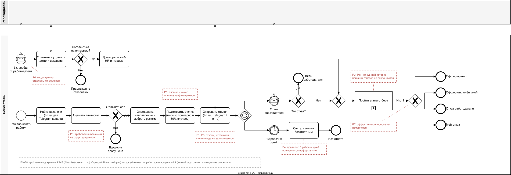

# Процесс поиска работы: AS-IS

| | |
|---|---|
| Версия | 1.3 |
| Дата | 08.10.2026 |
| Автор | Юрий Савиных |
| Статус | Утверждён автором |
| Связанные документы | [Vision & Scope](../requirements/01-vision-and-scope.md) |

## 1. Назначение документа

Описать, как поиск работы ведётся **сейчас**, без CRM, и выявить проблемы, которые
решает проект. Документ служит основанием для требований и модели TO-BE.
Описание составлено по ответам автора, непроверенных допущений в нём нет.

## 2. Границы описания

- **Начало процесса:** поиск вакансий (сценарий A) или входящее сообщение от
  работодателя (сценарий B).
- **Конец процесса:** оффер, отказ, решение прекратить общение или отсутствие ответа.
- **Не описываем:** подготовку резюме и процесс выхода на новую работу.
- **Участники:** соискатель; работодатель (HR-специалист, нанимающий менеджер,
  служба безопасности).
- **Каналы:** hh.ru, Telegram, почта.
- **Направления:** системный / бизнес-аналитик (SA/BA) и технический писатель (TW).
  Резюме по одному на направление, процесс одинаков для обоих направлений.

## 3. Ключевые показатели текущего процесса

| Показатель | Значение |
|------------|----------|
| Откликов в неделю | около 70 (около 50 по SA/BA и около 20 по TW) |
| Время на поиск, отклики и ответы на вопросы в форме отклика | около 1 часа в день по будням, около 5 часов в неделю; в выходные отклики отправляются редко |
| Среднее время на один отклик (расчётная оценка: 300 минут / 70 откликов) | около 4 минут |
| Откликов с сопроводительным письмом | около 50%; письмо готовое, адаптация под вакансию около 5% |
| Входящих контактов от работодателей | около 2 в неделю, чаще всего в Telegram |
| Пропущенные ответы работодателей | не бывает (оценка автора) |
| Фиксация откликов | не ведётся |

## 4. Сценарий A: отклик по инициативе соискателя

| № | Шаг | Что происходит | Каналы | Результат | Фиксируется |
|---|-----|----------------|--------|-----------|-------------|
| 1 | Поиск вакансий | Поиск по заранее заданным параметрам, в основном на hh.ru. Просмотр двух тематических Telegram-каналов (SA/BA и «Технические писатели»), где иногда публикуют вакансии | hh.ru, Telegram | Набор вакансий для просмотра | Нет |
| 2 | Первичный отбор | Читает вакансию, оценивает интерес и релевантность. Неподходящие пропускает | hh.ru, Telegram, сайты компаний | Решение: откликаться или нет | Нет |
| 3 | Определение направления | Относит вакансию к SA/BA или TW. Гибриды СА/БА/Fullstack относит к SA/BA. Резюме одно на направление | — | Направление вакансии | Нет |
| 4 | Подготовка отклика | Использует готовое сопроводительное письмо (около половины откликов идут с письмом); адаптирует его под вакансию примерно в 5% случаев. Иногда отвечает на вопросы работодателя в форме отклика | hh.ru, шаблон письма | Готовый отклик | Нет |
| 5 | Отправка отклика | Отправляет отклик через hh.ru, в Telegram или письмом на почту (если вакансия найдена на сайте компании) | hh.ru, Telegram, почта | Отправленный отклик | Нет |
| 6 | Ожидание ответа | Ответы приходят чаще всего в Telegram (он указан основным каналом связи), реже в чат hh.ru, ещё реже на почту. Ответы не пропускаются | Telegram, hh.ru, почта | Ответ работодателя или тишина | Нет |
| 7 | Безответные отклики | Если ответа нет 10 рабочих дней, отклик считается безответным. Follow-up делается редко: только если стороны договорились об обратной связи, а в срок её нет | Telegram, hh.ru, почта | Отклик считается безответным | Нет |
| 8 | Этапы отбора | После ответа: первичное интервью с HR → техническое собеседование → знакомство с командой (необязательно) → проверка службы безопасности (необязательно) → оффер. Тестовое задание может быть на любом этапе | Телефон, видеосвязь, мессенджеры, почта | Результаты этапов | Нет |
| 9 | Завершение | Оффер (принимается или отклоняется), отказ работодателя, отказ соискателя или прекращение общения | — | Итог процесса | Нет |
| 10 | Оценка поиска | Не выполняется: эффективность направлений, источников и каналов не измеряется | — | — | Нет |

## 5. Сценарий B: входящий контакт от работодателя

| № | Шаг | Что происходит | Каналы | Результат | Фиксируется |
|---|-----|----------------|--------|-----------|-------------|
| B1 | Входящее сообщение | Работодатель (HR) пишет соискателю первым. Около 2 раз в неделю, чаще в Telegram | Telegram, hh.ru, почта | Предложение о вакансии | Нет |
| B2 | Ответ и уточнение | Соискатель отвечает практически сразу, выясняет подробности о вакансии и условиях | Тот же канал | Понимание вакансии | Нет |
| B3 | Решение и договорённость | Соискатель решает, продолжать ли общение. При согласии стороны назначают интервью | Тот же канал | Назначенное HR-интервью или отказ от продолжения | Нет |
| B4 | Дальнейшие этапы | Далее процесс идёт как в сценарии A, начиная с шага 8 (этапы отбора) | См. шаг 8 | Итог процесса | Нет |

## 6. Проблемы AS-IS

| ID | Проблема | Где проявляется | Цель и вопросы |
|----|----------|-----------------|----------------|
| P1 | Отклики не фиксируются: сведения о них существуют только в переписках на площадках (hh.ru, Telegram, почта) | Шаги 5, 6 | G1 |
| P2 | Нет единой истории процесса: статус, даты и договорённости по каждому отклику разбросаны по трём каналам | Шаги 6–9 | G1, Q4 |
| P3 | Не фиксируется, каким каналом, из какого источника и с письмом или без ушёл отклик | Шаги 1, 4, 5 | G2, Q3, Q9, Q11 |
| P4 | Правило безответных откликов (10 рабочих дней) применяется неформально, без единого списка | Шаг 7 | G1, решение D10 |
| P5 | История этапов и причины отказов не сохраняются | Шаги 8, 9 | G2, Q2, Q8 |
| P6 | Входящие контакты от работодателей (около 2 в неделю) не отделены от откликов, поэтому их нельзя учесть отдельно в воронке | Сценарий B | G2, Q10, решение D11 |
| P7 | Нет метрик: эффективность направлений, источников, каналов и сопроводительного письма оценивается без данных; при около 70 откликах в неделю (3–4 тысячи в год) без учёта это сделать невозможно | Шаг 10 | G2, Q1–Q3, Q9–Q11 |
| P8 | Требования вакансий (навыки) и зарплатные вилки не структурируются, пробелы в навыках не видны | Шаги 2, 8, 10 | G3, Q5–Q7 |

## 7. Выводы для TO-BE

- **Сам поиск и отправка откликов остаются на площадках.** CRM только фиксирует уже
  выполненные действия и не заменяет hh.ru, Telegram и почту.
- **Объём ввода критичен.** Около 70 откликов в неделю при среднем времени около
  4 минут на отклик. Ввод в 1 минуту добавит около 70 минут в неделю (около 23% к
  нынешним 5 часам), поэтому форма ввода должна быть минимальной (цель G4, риск R1).
- **Ответы не пропускаются.** Задача системы не в напоминании об ответах, а в сборе
  единой истории процесса. Риск R11 связан не с пропуском ответа, а с задержкой ввода.
- **Письмо одно и готовое.** Для Q11 достаточно признака «с письмом / без»; версии
  письма не нужны.
- **Входящие контакты стартуют не с отклика.** Процесс, начатый работодателем, не имеет
  этапа «отклик» и начинается с согласования HR-интервью (сценарий B). Модель данных и
  воронка должны это учитывать (решение D11).
- **Канал ответа может не совпадать с каналом отклика.** Отклик на hh.ru часто получает
  ответ в Telegram, потому что он указан в сопроводительном письме. Решение автора (D12):
  канал общения хранится отдельно от канала отклика.

## 8. Диаграмма BPMN

На диаграмме те же два сценария: сценарий B (входящий контакт) в верхнем ряду, сценарий A
(отклик по инициативе соискателя) в нижнем. Красные аннотации ссылаются на проблемы P1–P8
из раздела 6.

Исходник для редактирования: [01-as-is.drawio](diagrams/01-as-is.drawio).

## 9. Журнал изменений

| Версия | Дата | Изменения |
|--------|------|-----------|
| 1.0 | 08.10.2026 | Первая версия по ответам автора: сценарии A и B, ключевые показатели, проблемы P1–P8, выводы для TO-BE |
| 1.1 | 08.10.2026 | Уточнён вывод о канале общения (решение D12) |
| 1.2 | 08.10.2026 | Документ утверждён автором без изменений содержания |
| 1.3 | 08.10.2026 | Добавлена диаграмма BPMN (раздел 8); журнал изменений перенесён в раздел 9 |