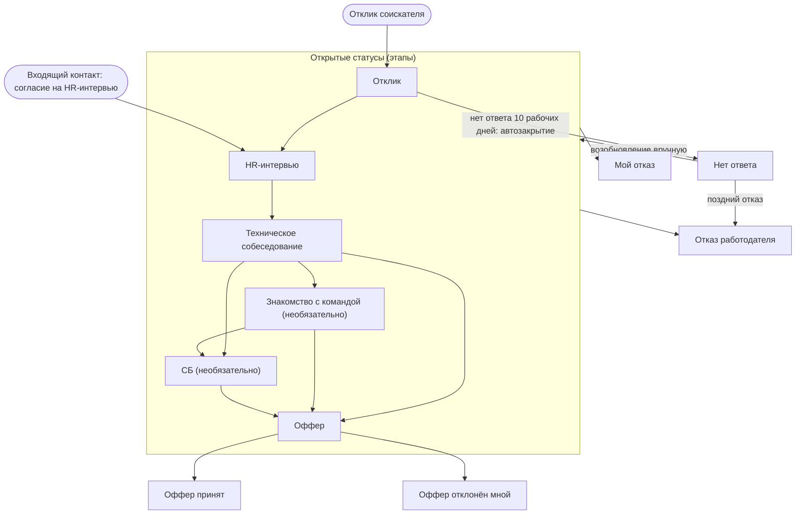

# Статусная модель процесса

| | |
|---|---|
| Версия | 1.0 |
| Дата | 08.10.2026 |
| Автор | Юрий Савиных |
| Статус | На проверке автором |
| Связанные документы | [Vision & Scope](../requirements/01-vision-and-scope.md), [TO-BE](02-to-be-job-search.md) |

## 1. Назначение документа

Описать статусы процесса (отклика или входящего контакта), правила их смены и расчёта
воронки. Документ служит основанием для справочника статусов и таблицы истории в
модели данных.

## 2. Статусы

Статус описывает текущее положение процесса. Открытые статусы соответствуют этапам
воронки (решение D9), закрытые являются итогами. Тестовое задание статусом не
является, это событие внутри любого этапа.

| Код | Название | Тип | Порядок | Обязательный этап | Что означает дата записи |
|-----|----------|-----|---------|-------------------|--------------------------|
| `APPLIED` | Отклик | Этап | 1 | Да | Дата отправки отклика |
| `HR_INTERVIEW` | HR-интервью | Этап | 2 | Да | Дата интервью (прошедшего или запланированного); для входящего процесса это начальный статус |
| `TECH_INTERVIEW` | Техническое собеседование | Этап | 3 | Да | Дата собеседования |
| `TEAM_MEETING` | Знакомство с командой | Этап | 4 | Нет | Дата знакомства |
| `SECURITY_CHECK` | СБ | Этап | 5 | Нет | Дата проверки или её начала |
| `OFFER` | Оффер | Этап | 6 | Да | Срок ответа на оффер |
| `OFFER_ACCEPTED` | Оффер принят | Итог | нет | нет | Дата закрытия |
| `OFFER_DECLINED` | Оффер отклонён мной | Итог | нет | нет | Дата закрытия |
| `REJECTED_BY_EMPLOYER` | Отказ работодателя | Итог | нет | нет | Дата закрытия |
| `WITHDRAWN_BY_ME` | Мой отказ | Итог | нет | нет | Дата закрытия |
| `NO_RESPONSE` | Нет ответа | Итог | нет | нет | Расчётная дата закрытия (правило SR4) |

## 3. Диаграмма статусов

Диаграмма показывает типичный путь. Любой статус можно установить вручную в любое
время (решение D14).

## 4. Правила

| ID | Правило |
|----|---------|
| SR1 | **Начальный статус.** Отклик соискателя создаётся в статусе `APPLIED` с датой отклика. Процесс, начатый работодателем, создаётся в статусе `HR_INTERVIEW` после согласия на интервью (решение D11); дата начала процесса равна дате первого контакта, дата записи равна дате интервью |
| SR2 | **Ручная смена.** Любой статус можно установить в любое время (решение D14). Система не блокирует переходы, а при нетипичном показывает предупреждение (см. раздел 5) |
| SR3 | **Достижение этапа.** Этап считается достигнутым, когда соискатель установил соответствующий статус при приглашении на этап, в том числе если дата этапа ещё в будущем. Если этап не состоялся, его запись удаляется (решение D22). Это правило закрывает вопрос TQ1 версии 0.1 |
| SR4 | **Автозакрытие.** Условия: инициатор «соискатель», статус `APPLIED`, дата первого ответа не заполнена, текущая дата позже срока «дата отклика + 10 рабочих дней» (пн–пт, праздники не учитываются). Действие: статус `NO_RESPONSE` с расчётной датой закрытия, равной сроку, чтобы результат не зависел от дня запуска приложения. Выполняется при запуске приложения и при открытии списка «Требуют действия» (решение D10). Шаблонные отказы hh.ru не вносятся и закрываются этим же правилом (решение D19) |
| SR5 | **Возобновление.** Процесс `NO_RESPONSE` можно перевести в любой открытый статус вручную. При этом обязательно указывается дата ответа, она становится датой первого ответа. Поздний отказ переводит процесс в `REJECTED_BY_EMPLOYER` без предупреждения |
| SR6 | **Ответ работодателя.** Ответ статус не меняет: фиксируется дата первого ответа и канал общения. Процесс с ответом не подлежит автозакрытию. Если ответ не отказ и у открытого процесса нет запланированного этапа, процесс попадает в список «Требуют действия» (решения D13, D17, D21) |
| SR7 | **Тестовое задание.** Фиксируется событиями «получено» (со сроком сдачи), «сдано», «результат» и привязывается к статусу, действующему на момент события |
| SR8 | **Навыки.** Ввод навыков доступен, если в истории процесса есть статус `HR_INTERVIEW` или более поздний этап (решение D8) |
| SR9 | **Причина отказа.** Обязательна при закрытии статусом `REJECTED_BY_EMPLOYER` или `WITHDRAWN_BY_ME`, если в истории есть этап `HR_INTERVIEW` или более поздний либо тестовое задание; значения: без причины, не подошёл опыт, выбрали другого, условия не подошли мне, другое (решение D16) |
| SR10 | **История.** Каждая смена статуса добавляет запись: статус, дата этапа (прошедшая или запланированная, решение D21), момент записи, кто изменил (соискатель или система), комментарий. Прежние записи при смене статуса не перезаписываются. Дату этапа можно исправить, а запись этапа, который не состоялся, удалить; история таких исправлений не ведётся (решение D22) |
| SR11 | **Расчёт воронки.** Воронка строится по истории, а не по текущему статусу (решение D14). Для обязательных этапов (порядок 1, 2, 3, 6) процесс достиг этапа, если в истории есть статус с порядком не меньше порядка этапа. Для необязательных этапов (порядок 4 и 5) считаются только процессы, у которых этот статус действительно был. В воронку входят только процессы с инициатором «соискатель» (решение D11) |
| SR12 | **Повторные этапы.** Один и тот же статус можно установить несколько раз (например, два технических собеседования подряд); каждая установка является отдельной записью со своей датой. Воронка считает процессы, а не записи; для Q2 берётся дата первой записи нужного статуса |

## 5. Нетипичные переходы

Нетипичный переход не блокируется: система показывает предупреждение, и соискатель
подтверждает смену статуса (риск R10).

| Типичные переходы | Нетипичные переходы (предупреждение) |
|-------------------|--------------------------------------|
| `APPLIED` → `HR_INTERVIEW` → `TECH_INTERVIEW` → `OFFER` | Возврат на более ранний этап |
| `TECH_INTERVIEW` → `TEAM_MEETING` и/или `SECURITY_CHECK` → `OFFER` | Пропуск обязательного этапа, например `APPLIED` → `TECH_INTERVIEW` или `HR_INTERVIEW` → `OFFER` |
| Любой открытый статус → `REJECTED_BY_EMPLOYER` или `WITHDRAWN_BY_ME` | Переход из итога в открытый статус, кроме `NO_RESPONSE` |
| `OFFER` → `OFFER_ACCEPTED` или `OFFER_DECLINED` | Изменение статуса после `OFFER_ACCEPTED` или `OFFER_DECLINED` |
| `APPLIED` → `NO_RESPONSE` (только система) | Установка `NO_RESPONSE` вручную из статуса, отличного от `APPLIED` |
| `NO_RESPONSE` → любой открытый статус или `REJECTED_BY_EMPLOYER` | |

## 6. Пример автозакрытия

Отклик отправлен в пятницу 02.10.2026. Рабочие дни: 05, 06, 07, 08, 09, 12, 13, 14,
15 и 16 октября, десятый приходится на 16.10.2026. Срок равен 16.10.2026. Если ответа
нет, при первом запуске приложения начиная с 17.10.2026 процесс получает статус
`NO_RESPONSE` с датой закрытия 16.10.2026.

## 7. Открытые вопросы

Открытых вопросов нет.

## 8. Журнал изменений

| Версия | Дата | Изменения |
|--------|------|-----------|
| 0.1 | 08.10.2026 | Черновик: 11 статусов, диаграмма, правила SR1–SR11, нетипичные переходы, пример автозакрытия |
| 0.2 | 08.10.2026 | Закрыт TQ1 (SR3); дата этапа в каждой записи истории (SR10, решение D21); добавлено SR12 о повторных этапах; уточнены SR1, SR4, SR6 с учётом D17, D19; добавлен вопрос TQ8 |
| 1.0 | 08.10.2026 | Закрыт TQ8: правка даты и удаление этапов без истории переносов (D22); уточнены SR3 и SR10; открытых вопросов нет |