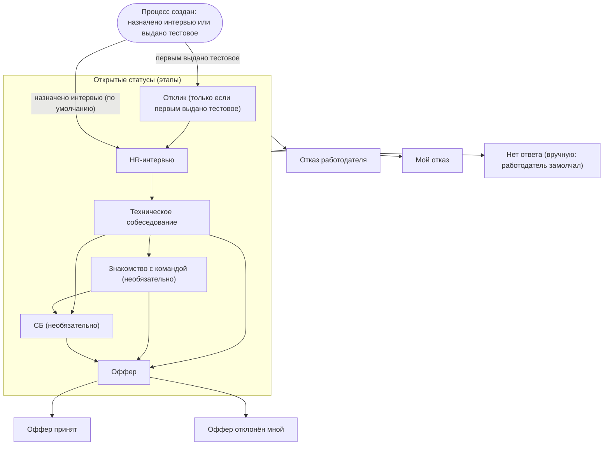

# Статусная модель процесса

| | |
|---|---|
| Версия | 2.0 |
| Дата | 10.10.2026 |
| Автор | Юрий Савиных |
| Статус | На проверке автором |
| Связанные документы | [Vision & Scope](../requirements/01-vision-and-scope.md), [ADR-001](../adr/ADR-001-record-only-qualified-processes.md), [TO-BE](02-to-be-job-search.md) |

## 1. Назначение документа

Описать статусы процесса (квалифицированного отклика или входящего контакта), правила их смены,
расчёта воронки и напоминаний. Документ служит основанием для справочника статусов и таблицы
истории в модели данных.

## 2. Статусы

Статус описывает текущее положение процесса. Открытые статусы соответствуют этапам (решение D9),
закрытые являются итогами. Тестовое задание статусом не является, это событие внутри любого
этапа.

| Код | Название | Тип | Порядок | Обязательный этап | В воронке | Что означает дата записи |
|-----|----------|-----|---------|-------------------|-----------|--------------------------|
| `APPLIED` | Отклик | Этап | 1 | Нет | Нет | Дата выдачи тестового задания; начальный статус только если первым выдано тестовое (D25) |
| `HR_INTERVIEW` | HR-интервью | Этап | 2 | Да | Да | Дата интервью (прошедшего или запланированного); начальный статус по умолчанию |
| `TECH_INTERVIEW` | Техническое собеседование | Этап | 3 | Да | Да | Дата собеседования |
| `TEAM_MEETING` | Знакомство с командой | Этап | 4 | Нет | Да | Дата знакомства |
| `SECURITY_CHECK` | СБ | Этап | 5 | Нет | Да | Дата проверки или её начала |
| `OFFER` | Оффер | Этап | 6 | Да | Да | Срок ответа на оффер |
| `OFFER_ACCEPTED` | Оффер принят | Итог | нет | нет | нет | Дата закрытия |
| `OFFER_DECLINED` | Оффер отклонён мной | Итог | нет | нет | нет | Дата закрытия |
| `REJECTED_BY_EMPLOYER` | Отказ работодателя | Итог | нет | нет | нет | Дата закрытия |
| `WITHDRAWN_BY_ME` | Мой отказ | Итог | нет | нет | нет | Дата закрытия |
| `NO_RESPONSE` | Нет ответа | Итог | нет | нет | нет | Дата закрытия; означает «работодатель замолчал после этапа» (D26) |

## 3. Диаграмма статусов

Диаграмма показывает типичный путь. Любой статус можно установить вручную в любое время
(решение D14).

## 4. Правила

| ID | Правило |
|----|---------|
| SR1 | **Начальный статус.** Процесс создаётся сразу с первым назначенным этапом и его датой. По умолчанию это `HR_INTERVIEW` (дата интервью); если первым выдано тестовое задание, это `APPLIED` (дата выдачи тестового, D25). Допускается начать с любого этапа (TQ11). Создать процесс сразу с итогом нельзя. У процесса, начатого работодателем (D11), начальный статус выбирается так же |
| SR2 | **Ручная смена.** Любой статус можно установить в любое время (решение D14). Система не блокирует переходы, а при нетипичном показывает предупреждение (раздел 5) |
| SR3 | **Достижение этапа.** Этап считается достигнутым, когда соискатель установил соответствующий статус при назначении этапа, в том числе если дата этапа ещё в будущем. Если этап не состоялся, его запись удаляется (решение D22) |
| SR4 | **Отменено** (решение D24, ADR-001): автозакрытие безответных откликов |
| SR5 | **Отменено** (решение D24, ADR-001): возобновление автоматически закрытого процесса. Вернуть закрытый процесс в работу можно вручную, установив любой открытый статус (раздел 5) |
| SR6 | **Отменено** (решение D23, ADR-001): фиксация ответа работодателя и даты первого ответа |
| SR7 | **Тестовое задание.** Фиксируется событиями «получено» (со сроком сдачи), «сдано» и «результат» и привязывается к статусу, действовавшему на момент получения. Если тестовое выдано первым, процесс создаётся со статусом `APPLIED` и тестовым заданием |
| SR8 | **Навыки.** Ввод навыков доступен, если в истории процесса есть статус `HR_INTERVIEW` или более поздний этап (решение D8) |
| SR9 | **Причина отказа.** Обязательна при закрытии статусом `REJECTED_BY_EMPLOYER` или `WITHDRAWN_BY_ME`, если в истории есть этап `HR_INTERVIEW` или более поздний либо тестовое задание; значения: без причины, не подошёл опыт, выбрали другого, условия не подошли мне, другое (решение D16) |
| SR10 | **История.** Каждая смена статуса добавляет запись: статус, дата этапа (прошедшая или запланированная, решение D21), момент записи, комментарий. Прежние записи при смене статуса не перезаписываются. Дату этапа можно исправить, а запись этапа, который не состоялся, удалить; история таких исправлений не ведётся (решение D22) |
| SR11 | **Расчёт воронки.** Воронка строится по истории, а не по текущему статусу (решение D14). Статус `APPLIED` в воронке не участвует. Для обязательных этапов (`HR_INTERVIEW`, `TECH_INTERVIEW`, `OFFER`) процесс достиг этапа, если в истории есть статус этапа с порядком не меньше порядка этого этапа. Для необязательных этапов (`TEAM_MEETING`, `SECURITY_CHECK`) считаются только процессы, у которых этот статус действительно был. В воронку входят процессы обоих инициаторов, по умолчанию все, с фильтром по инициатору (D30). Процессы, у которых в истории только `APPLIED`, показываются отдельной строкой «только тестовое» (D25) |
| SR12 | **Повторные этапы и дни между этапами.** Один и тот же статус можно установить несколько раз (например, два технических собеседования); каждая установка является отдельной записью со своей датой. Воронка считает процессы, а не записи. Для Q2 берётся дата первой записи каждого этапа; число дней между этапами A и B равно разнице календарных дат (D29); в расчёт входят только процессы с обоими этапами, пары с отрицательной разницей исключаются как ошибочные и помечаются предупреждением |
| SR13 | **Запланированный этап и напоминания.** Запланированными считаются: запись истории с этапом (тип «Этап») и датой не раньше текущей, а также несданное тестовое задание со сроком сдачи не раньше текущей даты. Напоминания относятся только к открытым процессам (текущий статус — этап) и показываются тремя группами (D27): «Сегодня и завтра» (дата от сегодня до сегодня + 1), «В ближайшие 7 дней» (от сегодня + 2 до сегодня + 7), «Нет запланированного этапа» (у открытого процесса нет запланированных этапов и несданных тестовых со сроком; D17). Тестовое задание без срока сдачи запланированным не считается |
| SR14 | **«Нет ответа».** Статус `NO_RESPONSE` устанавливается вручную из любого открытого статуса и означает, что работодатель замолчал после этапа (D26). Причина отказа не запрашивается. Если работодатель позже ответил, процесс можно вернуть в работу, установив открытый статус вручную |

## 5. Нетипичные переходы

Нетипичный переход не блокируется: система показывает предупреждение, и соискатель
подтверждает смену статуса (риск R10).

| Типичные переходы | Нетипичные переходы (предупреждение) |
|-------------------|--------------------------------------|
| `APPLIED` → `HR_INTERVIEW` → `TECH_INTERVIEW` → `OFFER` | Возврат на более ранний этап |
| `TECH_INTERVIEW` → `TEAM_MEETING` и/или `SECURITY_CHECK` → `OFFER` | Пропуск обязательного этапа, например `HR_INTERVIEW` → `OFFER` |
| Любой открытый статус → `REJECTED_BY_EMPLOYER`, `WITHDRAWN_BY_ME` или `NO_RESPONSE` | Переход из итога в открытый статус (возврат закрытого процесса в работу) |
| `OFFER` → `OFFER_ACCEPTED` или `OFFER_DECLINED` | Установка `OFFER_ACCEPTED` или `OFFER_DECLINED`, если в истории нет статуса `OFFER` |
| | Изменение статуса после `OFFER_ACCEPTED` или `OFFER_DECLINED` |

## 6. Примеры

### 6.1. Воронка и дни между этапами

Три процесса, все начаты откликом соискателя:

| Процесс | История (статус, дата) |
|---------|------------------------|
| P-1 | `APPLIED` 02.10.2026, `HR_INTERVIEW` 08.10.2026, `TECH_INTERVIEW` 15.10.2026, `OFFER` 24.10.2026 |
| P-2 | `HR_INTERVIEW` 09.10.2026 |
| P-3 | `APPLIED` 05.10.2026 |

Воронка: HR-интервью достигли 2 процесса (P-1, P-2), техническое собеседование 1 (P-1), оффер 1
(P-1); «только тестовое» 1 (P-3). Конверсия HR → техническое 50%, техническое → оффер 100%
(N очень мал, пометка «малая выборка»). Дни между этапами: у P-1 от HR-интервью до технического
собеседования 7 календарных дней, от технического собеседования до оффера 9.

### 6.2. Напоминания

Сегодня 10.10.2026:

| Открытый процесс | История и тестовые | Группа |
|------------------|--------------------|--------|
| P-4 | Последний этап `TECH_INTERVIEW` 11.10.2026 | «Сегодня и завтра» |
| P-5 | Последний этап `HR_INTERVIEW` 12.10.2026 | «В ближайшие 7 дней» |
| P-6 | Последний этап `HR_INTERVIEW` 05.10.2026, тестовых нет | «Нет запланированного этапа» |
| P-7 | Последний этап 05.10.2026, несданное тестовое со сроком 14.10.2026 | «В ближайшие 7 дней» (срок сдачи) |

## 7. Открытые вопросы

| ID | Вопрос | Предварительный ответ |
|----|--------|-----------------------|
| TQ11 | Можно ли создать процесс сразу с любым этапом (например, с технического собеседования), а не только с HR-интервью или «Отклика»? | Да; в списке по умолчанию HR-интервью (см. TO-BE) |

## 8. Журнал изменений

| Версия | Дата | Изменения |
|--------|------|-----------|
| 0.1 | 08.10.2026 | Черновик: 11 статусов, диаграмма, правила SR1–SR11, нетипичные переходы, пример автозакрытия |
| 0.2 | 08.10.2026 | Закрыт TQ1 (SR3); дата этапа в каждой записи истории (SR10, решение D21); добавлено SR12 о повторных этапах; уточнены SR1, SR4, SR6 с учётом D17, D19; добавлен вопрос TQ8 |
| 1.0 | 08.10.2026 | Закрыт TQ8: правка даты и удаление этапов без истории переносов (D22); уточнены SR3 и SR10; открытых вопросов нет |
| 1.1 | 08.10.2026 | Документ утверждён автором без изменений содержания |
| 2.0 | 10.10.2026 | Переход к учёту только квалифицированных процессов (D23, ADR-001): правила SR4–SR6 отменены (автозакрытие, возобновление, ответ работодателя); начальный статус и роль статуса «Отклик» (D25); «Нет ответа» вручную (SR14, D26); в историю убран автор «система»; воронка без статуса «Отклик» (SR11) и дни между этапами (SR12, D29); напоминания (SR13, D27); новые примеры; вопрос TQ11 |