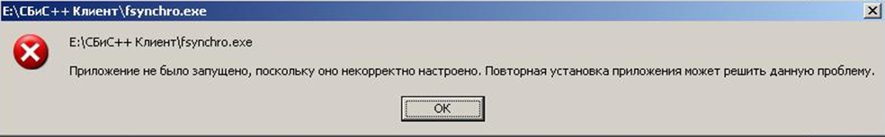

# Настройка сервера одноранговой сети
## Серверная часть

1.	Создаем на сервере папку **С:\Сбис++ Сервер** и переносим в нее всю папку с вашей программой;
>Если Сбис ++ 2.4 еще не установлен, [скачиваем](http://ereport.sbis.ru/download/sbis) и устанавливаем его в папку по умолчанию (на диск C:)  и переносим («Вырезаем») ее в **С:\Сбис++ Сервер**;

2.	Запускаем программу файлом **sbis.exe**;
>При первом запуске программа потребует создать налогоплательщика при помощи Мастера. Создаём (если Сбис уже был установлен, и налогоплательщик в нем был заведен, этот пункт пропускаем);

3.	Копируем в папку с установленной программой файл **fsynchro.exe**;

4.	Переносим из каталога с установленной программой папку **db** в основной каталог **С:\Сбис++ Сервер**. А саму папку с установленной программой, откуда вы убрали **db**, переименовываем в «**Modules**»;
>Тем самым мы получим каталог С:\Сбис++ Сервер, в котором будут 2 папки - это **db** (наша база данных в которой будет храниться все отчеты, налогоплательщики и т.д.) и папка «**Modules**» (так называемый эталонный каталог модулей с которым будет идти синхронизация с остальных рабочих мест);

5.	Открываем полный доступ к папке «**Modules**» (на запись, и на чтение);
>К папке **db** общий доступ открывать не нужно (это лишний раз обезопасит базу от пользователей), доступ к базе будет осуществляться через **MuzzleServer**;

6.	Скачиваем и устанавливаем «**СБИС Сервер одноранговой сети**» ([MuzzleServer](http://update.sbis.ru/versions/2.4/sbis-setup-muzzleserver.exe)) в папку по умолчанию;

7.	Указываем в нем путь к базе (в нашем случае это **С:\Сбис++ Сервер\db**). На следующем шаге всё оставляем по умолчанию. 
>После завершения в системном трее должен появиться значок сервера, и он должен иметь голубой цвет. 
Если цвет серый нужно еще раз проверить путь к базе, а также убедится, что порт **7777** открыт (при необходимости можно указать другой порт);

8.	На этом этап работы на сервере можно считать законченным. 

## Клиентская часть
***(Если планируется запускать программу с самого сервера, все равно для корректной работы программы нужно создать отдельный каталог с программой-клиентом, как указано ниже в инструкции)***

1.	Создаём папку, в которой будет находиться программа. Например, **С:\Сбис++ Клиент**;
2.	Копируем туда файлы **fsynchro.exe, fsynchro.ini, sbis.ini**;
3.	Открываем файл **fsynchro.ini**:

В первой строке: 

`КаталогИсточник=\\IP сервера\Папка с модулями`
>Указываем путь к эталонным модулям на сервере, где IP - это IP адрес сервера, а «Папка с модулями» - Modules. 

Во второй строке:

`КаталогПриемник=Путь до папки, куда будут синхронизироваться модули`
>В нашем случае это **С:\Сбис++ Клиент**;

4.	Сохраняем файл **fsynchro.ini**;
5.	Открываем файл **sbis.ini**:

В первой строке:

`БазаДанных=sbis-net://IP сервера: порт`
>Указываем IP сервера и порт, который вы указали в настройках muzzle-server. В нашем случае порт **7777**.

В строках:
```
КонфигСетевойКлиент=\\IP сервера\Папка с модулями
КонфигСинхронизация=\\IP сервера\Папка с модулями \ fsynchro.exe
```
>Здесь также указываем IP адрес сервера и папку с модулями. В нашем случае - Modules. Эти две строчки нужны для того, чтобы можно было обновлять программу с любого рабочего места, а не только с сервера.

6.	Сохраняем **sbis.ini**;

7.	Запускаем **fsynchro.exe** 
>в дальнейшем с него всегда будет запускаться Сбис, поэтому можно создать для него ярлык

8.	После запуска, в каталог **С:\Сбис++ Клиент** должны скопироваться все модули с сервера и запуститься сам Сбис.
---

>*В случае возникновения ошибки, типа:*
>
>*необходимо поставить библиотеку **vcredist_x86.***