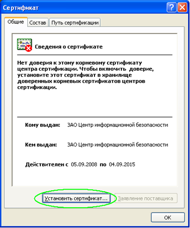
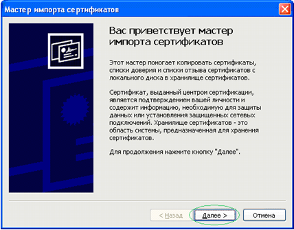
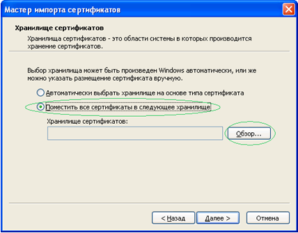
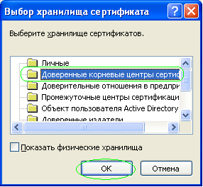
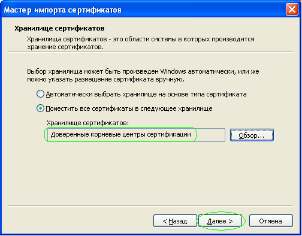
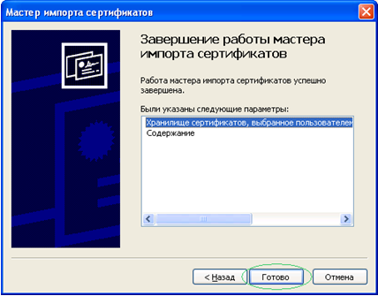
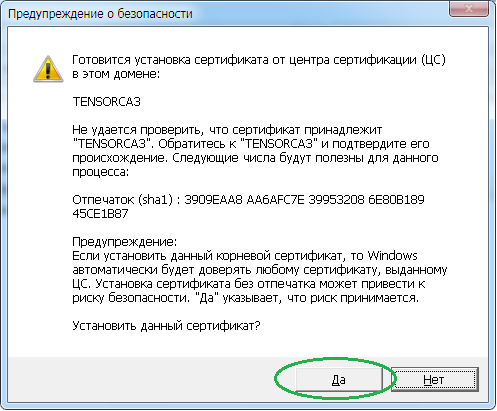
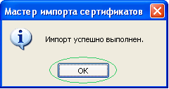

# Установка корневых сертификатов центров сертификации (ЦС)
1.	Двойным щелчком мышки откройте файл корневого сертификата ***.cer**
и нажимаем кнопку «**Установить сертификат…**»;

2.	Нажимите кнопку «**Далее**»;

3.	Выбирите пункт «**Поместить все сертификаты в следующее хранилище**»
и нажимите кнопку «**Обзор**»;

4.	В появившемся окне выбирите пункт «Доверенные корневые центры сертификации» и нажимите кнопку «**ОК**»;

5.	Нажимите кнопку «**Далее**»;

6.	Нажимите кнопку «**Готово**»;

7. В случае появления сообщения «**Предупреждение безопасности**», нажмите «**Да**»;

8.	Нажимите кнопку «**ОК**»;

>Повторите эти операции для всех необходимых корневых сертификатов.