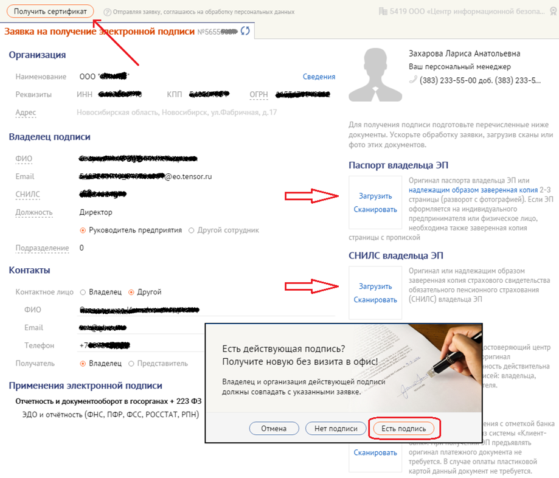
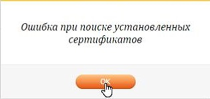

# Инструкция по продлению (обновлению) сертификата электронной подписи

## Важно:

- Продлить сертификат можно не ранее чем за 3 месяца до окончания его срока действия.

- Для продления необходим действующий сертификат и носитель (токен), на котором хранится закрытый ключ.

- Все действия выполняются от имени пользователя с правами администратора на компьютере.

- Если у вас истёк срок действия сертификата, процедура может отличаться — обратитесь к вашему менеджеру.

## Подготовьте отсканированные документы:

- Паспорт владельца электронной подписи (разворот с фото и страница с пропиской).

- СНИЛС владельца электронной подписи.

## Порядок действий:

1. **Запустите СБИС++** и откройте карточку вашей организации (меню «Контрагенты» → «Налогоплательщики»; в УБ — «Отправители»).

2. Перейдите на вкладку «**Ответственные лица**».

3. Напротив нужного сотрудника нажмите кнопку «**Продлить сертификат**».

4. В появившемся окне выберите вариант «**Получить по каналам связи**» и нажмите «**Далее**». Откроется онлайн-форма заявки на выпуск сертификата.

5. Заполните все пустые поля в форме. Убедитесь, что нет незаполненных строк. Прикрепите подготовленные скан-копии паспорта и СНИЛС. Проверьте правильность введённых данных.

6. Нажмите кнопку «**Получить сертификат**», затем «**Есть подпись**».

7. Следуя подсказкам мастера, сгенерируйте новый контейнер на том же носителе, на котором находится старый ключ. По желанию задайте пароль для нового контейнера (**обязятельно запомните его!**).

8. После этого произойдёт автоматическое подписание запроса вашим старым сертификатом. Дождитесь сообщения «**Сертификат успешно выпущен**». Закройте онлайн-форму.

9. Вернитесь в карточку организации на вкладку «**Ответственные лица**» и нажмите кнопку «**Проверить заявку**». Новый сертификат будет установлен в контейнер и автоматически привязан к сотруднику.

10. **Проверьте результат**: убедитесь, что у сотрудника появился новый сертификат с обновлённым сроком действия (он будет отображаться в списке сертификатов).

### Если форма не открывается или зависает:

- В браузере Internet Explorer может потребоваться запустить надстройку «**SbisPluginClient**». Щёлкните правой кнопкой мыши по строке запроса и выберите «**Запустить надстройку**».

- В случае возникновения ошибки при поиске установленных сертификатов, необходимо в браузере разрешить плагины на сайте ca.sbis.ru.

- При возникновении других проблем обращайтесь в техническую поддержку по телефону xxx-xx-xx.

**ВАЖНО!!! После получения новой электронной подписи обязательно сделайте её копию на случай утери или поломки ключевого носителя.**