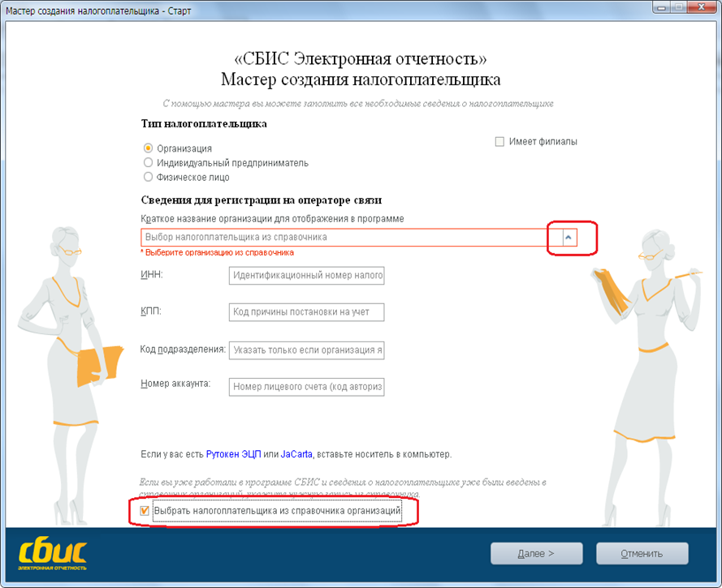
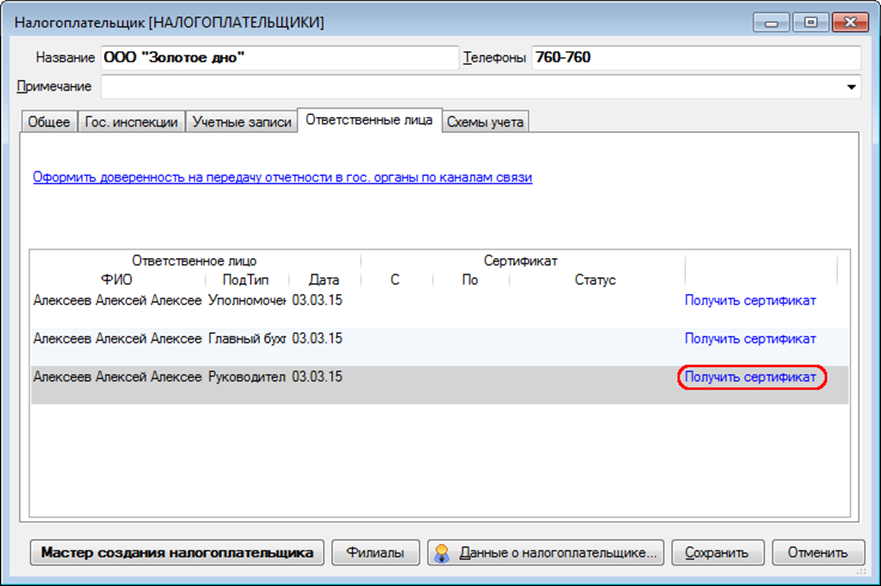
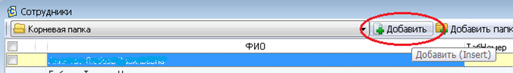
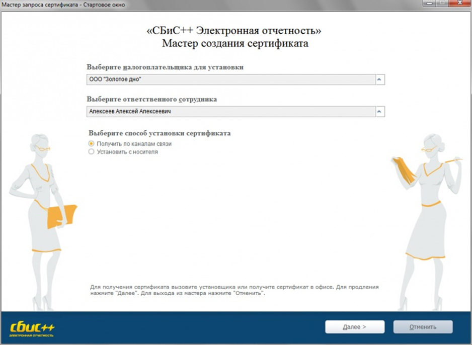
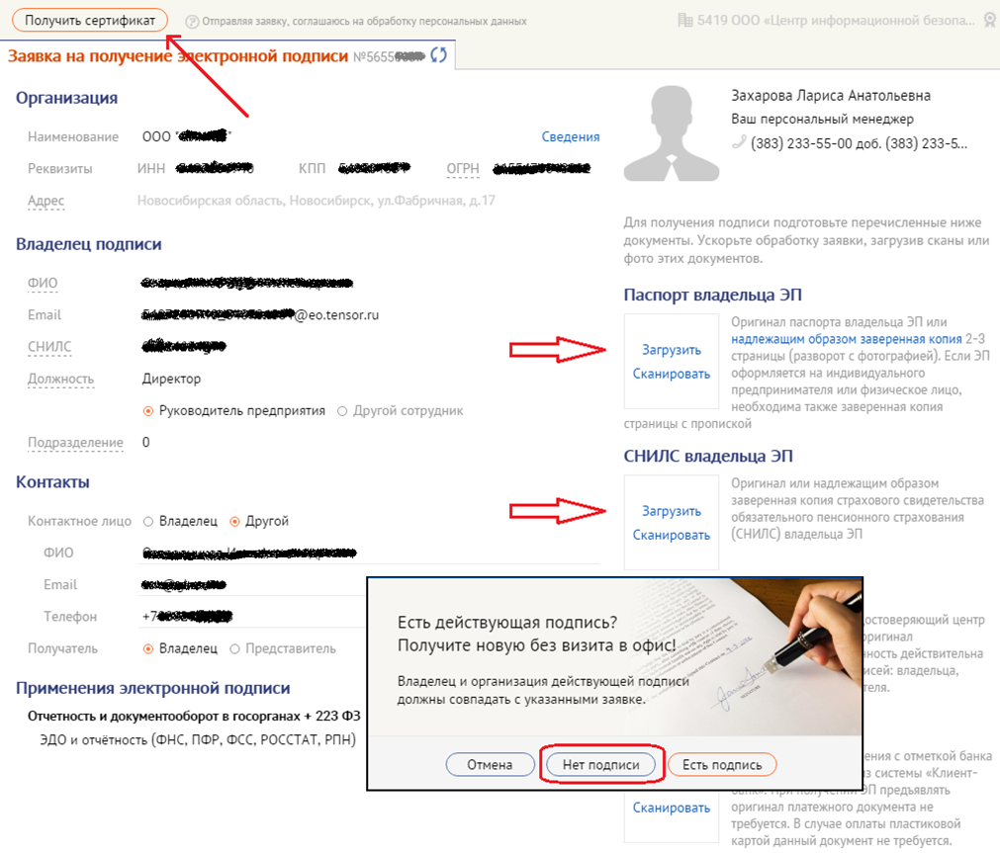
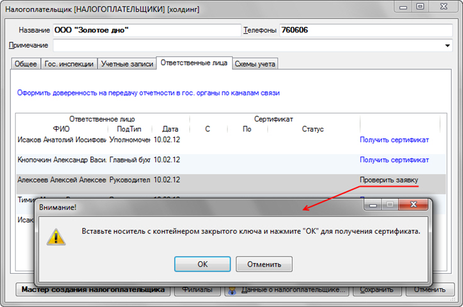

# Получение электронной подписи (ЭП)
## Общее описание процесса
Пользователь программы «СБИС++ Электронная отчётность» самостоятельно формирует запрос на выпуск квалифицированной электронной подписи на должностное лицо, после чего посещает офис удостоверяющего центра (ООО «ЦИБ») для документального подтверждения личности и подписания документов. По завершении сертификат устанавливается на рабочем месте пользователя.

**Альтернатива**: вы можете вызвать специалиста УЦ в свой офис для выездного оформления (услуга платная).

## Перед началом работы

- Убедитесь, что у вас есть носитель ключевой информации (flash-накопитель, Рутокен, eToken) с достаточным свободным местом для нового контейнера.
- Подготовьте отсканированные копии (или качественные фото) следующих документов:

   - паспорт владельца подписи (разворот с фото и страница с пропиской);
   - СНИЛС владельца подписи;
   - при необходимости – доверенность на представителя (если заявку подаёт не сам владелец).
- Для индивидуальных предпринимателей дополнительно может потребоваться выписка из ЕГРИП – уточните у менеджера.

### 1. Если организация ещё не добавлена в СБИС++

Если вы получаете ЭП для организации, которой нет в вашей программе, её нужно завести.

1. В меню выберите «**Контрагенты – Налогоплательщики**» и нажмите «**Добавить**».

2. В открывшемся «Мастере создания налогоплательщика» выберите «**Авторизоваться без электронной подписи**».

3. Установите галочку «**Выбрать налогоплательщика из справочника**», найдите нужную организацию и завершите работу мастера.

Если организация уже есть – переходите к следующему шагу.

## 2. Подача заявки на выпуск сертификата

1. Откройте карточку организации и перейдите на вкладку «**Ответственные лица**».

2. Нажмите кнопку «**Получить сертификат**».

> Если нужного сотрудника нет в списке, сначала заведите его в справочнике «**Контрагенты – Сотрудники**» (кнопка «Добавить»), затем добавьте его в «Ответственные лица».

3. В мастере создания сертификата выберите способ «**Получить по каналам связи**» и нажмите «**Далее**».

4. После проверки соединения с оператором в браузере откроется форма «**Заявка на получение электронной подписи**». Большинство полей заполнятся автоматически, но обязательно проверьте их и внесите недостающие данные:

   - **ОГРН / ОГРНИП** – основной государственный регистрационный номер организации или индивидуального предпринимателя.

   - **ИНН** – индивидуальный номер налогоплательщика (проверьте, чтобы он был указан верно).

   - **Адрес** – юридический адрес организации (для ИП – адрес регистрации по паспорту). Индивидуальные предприниматели в поле «Улица и дом» ставят «0» (ноль), если адрес совпадает с местом жительства.

   - **ФИО владельца** – полные фамилия, имя и отчество сотрудника или ИП.

   - **СНИЛС** – страховой номер индивидуального лицевого счёта владельца (обязательное поле).

> **Важно!** Все данные берите исключительно из учредительных и регистрационных документов. Ошибки в адресе или ФИО приведут к отказу в выпуске.

5. Прикрепите загруженные сканы документов (паспорт, СНИЛС, при необходимости – доверенность).

6. Проверьте все введённые данные, затем нажмите кнопку «**Получить сертификат**», а в следующем диалоге выберите «**Нет подписи**» (так как действующей подписи для подписания заявки у вас пока нет).

7. Произведите генерацию ключевой пары на ваш носитель (flash, токен). В процессе генерации система попросит задать пароль на контейнер. По желанию вы можете его установить, но **обязательно запомните или запишите** его в надёжном месте – без этого пароля использовать подпись будет невозможно.

## 3. Обработка заявки и визит в офис УЦ

1. После отправки заявка поступает в систему удостоверяющего центра.

2. Вам необходимо **согласовать время визита** в офис ООО «ЦИБ» – это можно сделать по телефону xxx-xx-xx или дождаться звонка менеджера.

3. Для визита возьмите с собой **оригиналы документов**, копии которых загружали:

   - паспорт владельца подписи;

   - СНИЛС;

   - при необходимости – доверенность (если подпись получает представитель, а не сам владелец).

4. В офисе специалист УЦ проверит подлинность документов и подтвердит вашу личность. 

## 4. Установка сертификата на рабочем месте
1. Вернувшись из офиса, вставьте носитель с ключом в компьютер.

2. Откройте карточку организации на вкладке «**Ответственные лица**».

3. Нажмите кнопку «**Проверить заявку**».

4. В появившемся сообщении нажмите «**ОК**». Сертификат автоматически установится в контейнер и привяжется к выбранному ответственному лицу.

5. Проверьте результат: в списке сертификатов сотрудника должен появиться новый сертификат с актуальным сроком действия.

## 5. Резервное копирование ключа

**ВАЖНО!** Сразу после получения нового ключа сделайте его резервную копию на другой носитель (флешку или жёсткий диск) и храните её в надёжном месте отдельно от основного токена. Это защитит вас от потери данных при поломке или утере основного носителя.

## 6. Завершающие действия в личном кабинете

После установки сертификата зайдите в личный кабинет системы и выполните следующие шаги:

1. [Подтвердите первичные документы](https://help.sbis.ru/help/edo/chet_fac/buy/)
2. [Задайте логин и пароль для входа в систему](https://help.sbis.ru/help/start/reg_sys/change_pass/) (если ещё не заданы)

>При возникновении вопросов обращайтесь в техническую поддержку по телефону xxx-xx-xx.