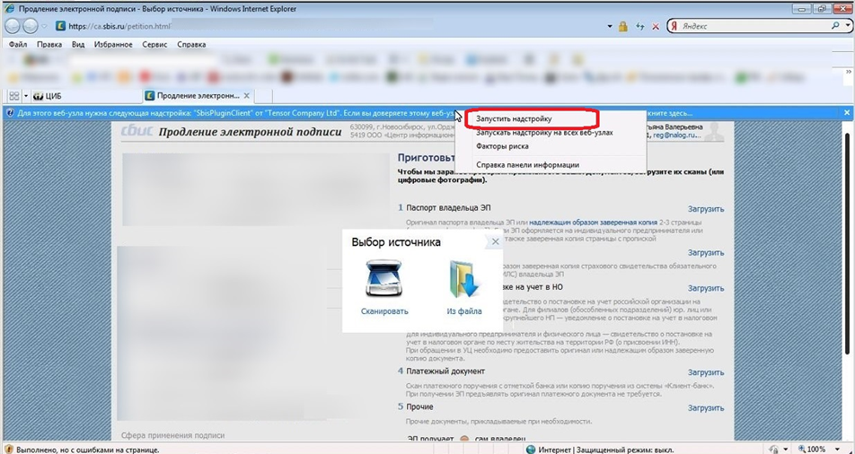

# Инструкция по продлению/смене сертификата

>*Продлять сертификат можно не ранее, чем за 3 месяца до срока его окончания.*

Для того чтобы продлить сертификат вам необходимо:
1. Подготовить следующие отсканированные документы:
- Паспорт владельца электронной подписи;
- СНИЛС владельца электронной подписи.

2. За 30 дней до истечения срока действия сертификата, СБиС++ сам предложит его обновить.
Если этого не произошло или вы хотите продлить сертификат раньше, нужно:

- Открыть карточку вашей организации на вкладке «**Ответственные лица**» (меню «Контрагенты», пункт «Налогоплательщики» (в УБ - «Отправители»));
- Напротив нужного сотрудника нажать "**Продлить сертификат**", указать вариант «**Получить по каналам связи**» и нажать **Далее**.
Откроется онлайн-форма заявки на выпуск сертификата;
- Заполнить пустые поля, если они есть (**все поля без исключения должны быть заполнены!**), прикрепить подготовленные документы (паспорт и СНИЛС владельца ключа). Проверить введенные данные;
- Нажать кнопку «**Получить сертификат**», затем «**Есть подпись**».

>*В случае возникновения ошибки при поиске установленных сертификатов, необходимо в браузере разрешить плагины на сайте ca.sbis.ru.*

- Следуя подсказкам на экране, сгенерируйте новый контейнер на тот же носитель, на котором находится старый ключ. Пароль на контейнер лучше не устанавливать (оставить пустым);
- Далее произойдет автоматическое подписание запроса вашим старым сертификатом и появится сообщение «Сертификат успешно выпущен». Онлайн-форму можно закрыть;
- В СБиС++ в карточке организации в «Ответственных лицах» нажмите "**Проверить заявку**", сертификат установится в контейнер и пропишется в карточку организации. Убедитесь, что у сотрудника появился новый сертификат.

**ВАЖНО!!! После получения нового ключа обязательно сделайте его копию на случай утери или поломки ключевого носителя.**

По вопросам продления обращайтесь в тех. поддержку по тел. ___.

>*если Вы используете браузер Internet Explorer, может потребоваться запуск надстройки «SbisPluginClient». Для этого щелкните правой кнопкой мыши на строку запроса, как показано на скриншоте ниже, и нажмите «Запустить надстройку».*
